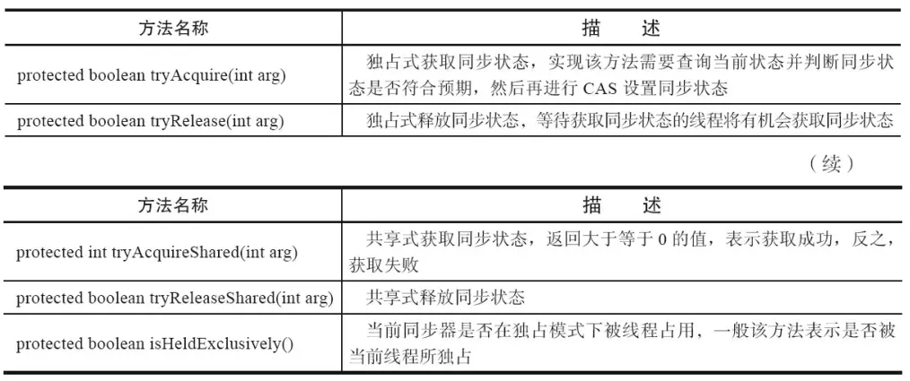
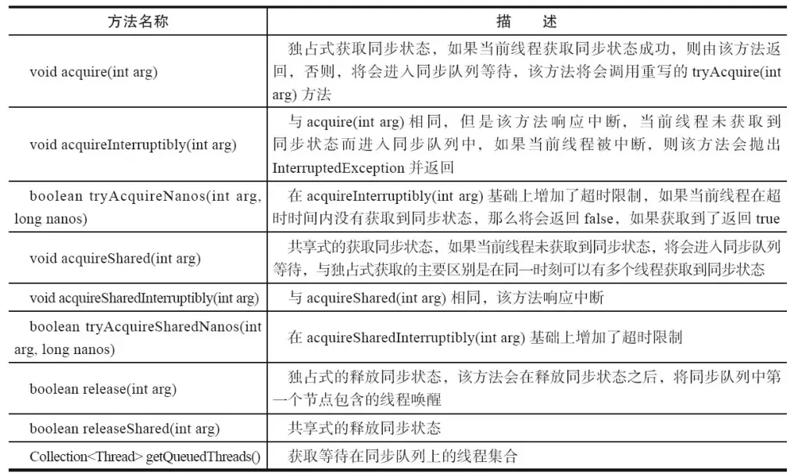

[TOC]

# AQS

AQS可重写的方法如下图：

实现同步组件时AQS提供的模板方法如下图：

## 如何写同步组件

AQS源码中的example:

```java
lass Mutex implements Lock, java.io.Serializable {
    // Our internal helper class
    // 继承AQS的静态内存类
    // 重写方法
    private static class Sync extends AbstractQueuedSynchronizer {
        // Reports whether in locked state
        protected boolean isHeldExclusively() {
            return getState() == 1;
        }

        // Acquires the lock if state is zero
        public boolean tryAcquire(int acquires) {
            assert acquires == 1; // Otherwise unused
            if (compareAndSetState(0, 1)) {
                setExclusiveOwnerThread(Thread.currentThread());
                return true;
            }
            return false;
        }

        // Releases the lock by setting state to zero
        protected boolean tryRelease(int releases) {
            assert releases == 1; // Otherwise unused
            if (getState() == 0) throw new IllegalMonitorStateException();
            setExclusiveOwnerThread(null);
            setState(0);
            return true;
        }

        // Provides a Condition
        Condition newCondition() {
            return new ConditionObject();
        }

        // Deserializes properly
        private void readObject(ObjectInputStream s)
                throws IOException, ClassNotFoundException {
            s.defaultReadObject();
            setState(0); // reset to unlocked state
        }
    }

    // The sync object does all the hard work. We just forward to it.
    private final Sync sync = new Sync();
    //使用同步器的模板方法实现自己的同步语义
    public void lock() {
        sync.acquire(1);
    }

    public boolean tryLock() {
        return sync.tryAcquire(1);
    }

    public void unlock() {
        sync.release(1);
    }

    public Condition newCondition() {
        return sync.newCondition();
    }

    public boolean isLocked() {
        return sync.isHeldExclusively();
    }

    public boolean hasQueuedThreads() {
        return sync.hasQueuedThreads();
    }

    public void lockInterruptibly() throws InterruptedException {
        sync.acquireInterruptibly(1);
    }

    public boolean tryLock(long timeout, TimeUnit unit)
            throws InterruptedException {
        return sync.tryAcquireNanos(1, unit.toNanos(timeout));
    }
}
```

MutexDemo：

```csharp
public class MutextDemo {
    private static Mutex mutex = new Mutex();

    public static void main(String[] args) {
        for (int i = 0; i < 10; i++) {
            Thread thread = new Thread(() -> {
                mutex.lock();
                try {
                    Thread.sleep(3000);
                } catch (InterruptedException e) {
                    e.printStackTrace();
                } finally {
                    mutex.unlock();
                }
            });
            thread.start();
        }
    }
}
```

上面的这个例子实现了独占锁的语义，在同一个时刻只允许一个线程占有锁。Mutex定义了一个**继承AQS的静态内部类Sync**,并且重写了AQS的tryAcquire等等方法，而对state的更新也是利用了setState(),getState()，compareAndSetState()这三个方法。在实现实现lock接口中的方法也只是调用了AQS提供的模板方法（因为Sync继承AQS）。在同步组件的实现上主要是利用了AQS，而AQS“屏蔽”了同步状态的修改，线程排队等底层实现，通过AQS的模板方法可以很方便的给同步组件的实现者进行调用。而针对用户来说，只需要调用同步组件提供的方法来实现并发编程即可。同时在新建一个同步组件时需要把握的两个关键点是：

1. 实现同步组件时推荐定义继承AQS的静态内存类，并重写需要的protected修饰的方法；
2. 同步组件语义的实现依赖于AQS的模板方法，而AQS模板方法又依赖于被AQS的子类所重写的方法。

**同步组件实现者的角度：**

通过可重写的方法：**独占式**： tryAcquire()(独占式获取同步状态），tryRelease()（独占式释放同步状态）；**共享式** ：tryAcquireShared()(共享式获取同步状态)，tryReleaseShared()(共享式释放同步状态)；**告诉AQS怎样判断当前同步状态是否成功获取或者是否成功释放**。同步组件专注于对当前同步状态的逻辑判断，从而实现自己的同步语义。，举例来说，上面的Mutex例子中通过tryAcquire方法实现自己的同步语义，在该方法中如果当前同步状态为0（即该同步组件没被任何线程获取），当前线程可以获取同时将状态更改为1返回true，否则，该组件已经被线程占用返回false。很显然，该同步组件只能在同一时刻被线程占用，Mutex专注于获取释放的逻辑来实现自己想要表达的同步语义。

**AQS的角度**

而对AQS来说，只需要同步组件返回的true和false即可，因为AQS会对true和false会有不同的操作，true会认为当前线程获取同步组件成功直接返回，而false的话就AQS也会将当前线程插入同步队列等一系列的方法。

## 实现原理

在AQS有一个静态内部类Node，其中有这样一些属性：

> volatile int waitStatus //节点状态
> volatile Node prev //当前节点/线程的前驱节点
> volatile Node next; //当前节点/线程的后继节点
> volatile Thread thread;//加入同步队列的线程引用
> Node nextWaiter;//等待队列中的下一个节点

节点的状态有以下这些：

> int CANCELLED = 1//节点从同步队列中取消,在同步队列中等待的线程等待超时或被中断
> int SIGNAL = -1//后继节点的线程处于等待状态，如果当前节点释放同步状态会通知后继节点，使得后继节点的线程能够运行；
> int CONDITION = -2//当前节点进入等待队列中
> int PROPAGATE = -3//表示下一次共享式同步状态获取将会无条件传播下去,表示可以传递性的一个接一个唤醒后继结点来尝试获取锁。
> int INITIAL = 0;//初始状态


```java
static final class Node {
        //共享节点
        static final Node SHARED = new Node();
        //非共享节点
        static final Node EXCLUSIVE = null;

        //取消状态（因超时或中断）
        static final int CANCELLED =  1;
        //等待唤醒
        static final int SIGNAL    = -1;
        //等待条件
        static final int CONDITION = -2;
        //对应共享类型释放资源时，传播唤醒线程状态
        static final int PROPAGATE = -3;
        //当前状态
        volatile int waitStatus;
        //前一个节点
        volatile Node prev;
        //下一个节点
        volatile Node next;
        //请求的线程
        volatile Thread thread;

        Node nextWaiter;

        final boolean isShared() {
            return nextWaiter == SHARED;
        }
        //获取前一个节点，为空则抛空指针异常
        final Node predecessor() throws NullPointerException {
            Node p = prev;
            if (p == null)
                throw new NullPointerException();
            else
                return p;
        }
        Node(Thread thread, Node mode) {     // Used by addWaiter
            this.nextWaiter = mode;
            this.thread = thread;
        }

        Node(Thread thread, int waitStatus) { // Used by Condition
            this.waitStatus = waitStatus;
            this.thread = thread;
        }

    }
```

另外AQS中有两个重要的成员变量：

```java
private transient volatile Node head;
private transient volatile Node tail;
```

以lock为例，调用lock()方法是获取独占式锁，获取失败就将当前线程加入同步队列，成功则线程执行。而lock()方法实际上会调用AQS的**acquire()**方法:

```java
public final void acquire(int arg) {
        //先看同步状态是否获取成功，如果成功则方法结束返回
        //若失败则先调用addWaiter()方法再调用acquireQueued()方法
        if (!tryAcquire(arg) && acquireQueued(addWaiter(Node.EXCLUSIVE), arg))
            selfInterrupt();
}
```

当线程获取独占式锁失败后就会将当前线程加入同步队列，addWaiter()源码如下：

```csharp
private Node addWaiter(Node mode) {
        // 1. 将当前线程构建成Node类型
        Node node = new Node(Thread.currentThread(), mode);
        // Try the fast path of enq; backup to full enq on failure
        // 2. 当前尾节点是否为null？
        Node pred = tail;
        if (pred != null) {
            // 2.2 将当前节点尾插入的方式插入同步队列中
            node.prev = pred;
            if (compareAndSetTail(pred, node)) {
                pred.next = node;
                return node;
            }
        }
        // 2.1. 当前同步队列尾节点为null，说明当前线程是第一个加入同步队列进行等待的线程
        enq(node);
        return node;
}
```

enq()源码如下：

```java
private Node enq(final Node node) {
        for (;;) {
            Node t = tail;
            if (t == null) { // Must initialize
                //1. 构造头结点
                if (compareAndSetHead(new Node()))
                    tail = head;
            } else {
                // 2. 尾插入，CAS操作失败自旋尝试
                node.prev = t;
                if (compareAndSetTail(t, node)) {
                    t.next = node;
                    return t;
                }
            }
        }
}
```

acquireQueued()方法，作用是排队获取锁的过程，源码如下：

```java
final boolean acquireQueued(final Node node, int arg) {
        //锁资源获取失败标记位
        boolean failed = true;
        try {
            //等待线程被中断标记位
            boolean interrupted = false;
            //这个循环体执行的时机包括新节点入队和队列中等待节点被唤醒两个地方
            for (;;) {
                //获取当前节点的前置节点
                final Node p = node.predecessor();
                //如果前置节点就是头结点，则尝试获取锁资源
                if (p == head && tryAcquire(arg)) {
                    //当前节点获得锁资源以后设置为头节点，这里继续理解我上面说的那句话
                    //头结点就表示当前正占有锁资源的节点
                    setHead(node);
                    p.next = null; //帮助GC
                    //表示锁资源成功获取，因此把failed置为false
                    failed = false;
                    //返回中断标记，表示当前节点是被正常唤醒还是被中断唤醒
                    return interrupted;
                }
                如果没有获取锁成功，则进入挂起逻辑
                if (shouldParkAfterFailedAcquire(p, node) &&
                    parkAndCheckInterrupt())
                    interrupted = true;
            }
        } finally {
            if (failed)
                cancelAcquire(node);
        }
    }
```

setHead()方法为：

```csharp
private void setHead(Node node) {
        head = node;
        node.thread = null;
        node.prev = null;
}
```

当获取锁失败的时候会调用shouldParkAfterFailedAcquire()方法和parkAndCheckInterrupt()方法,目前为止，我们只是根据当前线程，节点类型创建了一个节点并加入队列中，**其他属性都是默认值**。shouldParkAfterFailedAcquire()方法源码为：

```java
//首先说明一下参数，node是当前线程的节点，pred是它的前置节点
private static boolean shouldParkAfterFailedAcquire(Node pred, Node node) {
        //获取前置节点的waitStatus
        int ws = pred.waitStatus;
        if (ws == Node.SIGNAL)
            //如果前置节点的waitStatus是Node.SIGNAL则返回true，然后会执行parkAndCheckInterrupt()方法进行挂起
            return true;
        if (ws > 0) {
            //由waitStatus的几个取值可以判断这里表示前置节点被取消
            do {
                node.prev = pred = pred.prev;
            } while (pred.waitStatus > 0);
            //这里我们由当前节点的前置节点开始，一直向前找最近的一个没有被取消的节点
            //注，由于头结点head是通过new Node()创建，它的waitStatus为0,因此这里不会出现空指针问题，也就是说最多就是找到头节点上面的循环就退出了
            pred.next = node;
        } else {
            //根据waitStatus的取值限定，这里waitStatus的值只能是0或者PROPAGATE，那么我们把前置节点的waitStatus设为Node.SIGNAL然后重新进入该方法进行判断
            compareAndSetWaitStatus(pred, ws, Node.SIGNAL);
        }
        return false;
    }
```

shouldParkAfterFailedAcquire()方法主要逻辑是使用`compareAndSetWaitStatus(pred, ws, Node.SIGNAL)`使用CAS将节点状态由INITIAL设置成SIGNAL，表示当前线程阻塞。当compareAndSetWaitStatus设置失败则说明shouldParkAfterFailedAcquire方法返回false，然后会在acquireQueued()方法中for (;;)死循环中会继续重试，直至compareAndSetWaitStatus设置节点状态位为SIGNAL时shouldParkAfterFailedAcquire返回true时才会执行方法parkAndCheckInterrupt()方法，该方法的源码为：

```java
private final boolean parkAndCheckInterrupt() {
        //使得该线程阻塞
        LockSupport.park(this);
        return Thread.interrupted();
}
```

## 独占锁的释放（release()方法）

源码：

```java
public final boolean release(int arg) {
        if (tryRelease(arg)) {
            Node h = head;
            if (h != null && h.waitStatus != 0)
                unparkSuccessor(h);
            return true;
        }
        return false;
}
```

unparkSuccessor方法源码：

```csharp
private void unparkSuccessor(Node node) {
    /*
     * If status is negative (i.e., possibly needing signal) try
     * to clear in anticipation of signalling.  It is OK if this
     * fails or if status is changed by waiting thread.
     */
    int ws = node.waitStatus;
    if (ws < 0)
        compareAndSetWaitStatus(node, ws, 0);

    /*
     * Thread to unpark is held in successor, which is normally
     * just the next node.  But if cancelled or apparently null,
     * traverse backwards from tail to find the actual
     * non-cancelled successor.
     */

    //头节点的后继节点
    Node s = node.next;
    if (s == null || s.waitStatus > 0) {
        s = null;
        for (Node t = tail; t != null && t != node; t = t.prev)
            if (t.waitStatus <= 0)
                s = t;
    }
    if (s != null)
        //后继节点不为null时唤醒该线程
        LockSupport.unpark(s.thread);
}
```

首先获取头节点的后继节点，当后继节点的时候会调用LookSupport.unpark()方法，该方法会唤醒该节点的后继节点所包装的线程。因此，**每一次锁释放后就会唤醒队列中该节点的后继节点所引用的线程，从而进一步可以佐证获得锁的过程是一个FIFO（先进先出）的过程。**

总结：

1. **线程获取锁失败，线程被封装成Node进行入队操作，核心方法在于addWaiter()和enq()，同时enq()完成对同步队列的头结点初始化工作以及CAS操作失败的重试**;
2. **线程获取锁是一个自旋的过程，当且仅当 当前节点的前驱节点是头结点并且成功获得同步状态时，节点出队即该节点引用的线程获得锁，否则，当不满足条件时就会调用LookSupport.park()方法使得线程阻塞**；
3. **释放锁的时候会唤醒后继节点；**

## 可中断式获取锁（acquireInterruptibly方法）

lock相较于synchronized有一些更方便的特性，比如能响应中断以及超时等待等特性。可响应中断式锁可调用方法lock.lockInterruptibly();而该方法其底层会调用AQS的acquireInterruptibly方法，源码为：

```java
public final void acquireInterruptibly(int arg)
        throws InterruptedException {
    if (Thread.interrupted())
        throw new InterruptedException();
    if (!tryAcquire(arg))
        //线程获取锁失败
        doAcquireInterruptibly(arg);
}
```

在获取同步状态失败后就会调用doAcquireInterruptibly方法：

```java
private void doAcquireInterruptibly(int arg)
    throws InterruptedException {
    //将节点插入到同步队列中
    final Node node = addWaiter(Node.EXCLUSIVE);
    boolean failed = true;
    try {
        for (;;) {
            final Node p = node.predecessor();
            //获取锁出队
            if (p == head && tryAcquire(arg)) {
                setHead(node);
                p.next = null; // help GC
                failed = false;
                return;
            }
            if (shouldParkAfterFailedAcquire(p, node) &&
                parkAndCheckInterrupt())
                //线程中断抛异常
                throw new InterruptedException();
        }
    } finally {
        if (failed)
            cancelAcquire(node);
    }
}
```

与acquire方法逻辑几乎一致，唯一的区别是当**parkAndCheckInterrupt**返回true时即线程阻塞时该线程被中断，代码抛出被中断异常。

## 超时等待式获取锁（tryAcquireNanos()方法）

通过调用lock.tryLock(timeout,TimeUnit)方式达到超时等待获取锁的效果，该方法会在三种情况下才会返回：

1. 在超时时间内，当前线程成功获取了锁；
2. 当前线程在超时时间内被中断；
3. 超时时间结束，仍未获得锁返回false。

tryAcquireNanos(),源码为：

```java
public final boolean tryAcquireNanos(int arg, long nanosTimeout)
        throws InterruptedException {
    if (Thread.interrupted())
        throw new InterruptedException();
    return tryAcquire(arg) ||
        //实现超时等待的效果
        doAcquireNanos(arg, nanosTimeout);
}
```

doAcquireNanos方法实现超时等待的效果，该方法源码如下：

```java
private boolean doAcquireNanos(int arg, long nanosTimeout)
        throws InterruptedException {
    if (nanosTimeout <= 0L)
        return false;
    //1. 根据超时时间和当前时间计算出截止时间
    final long deadline = System.nanoTime() + nanosTimeout;
    final Node node = addWaiter(Node.EXCLUSIVE);
    boolean failed = true;
    try {
        for (;;) {
            final Node p = node.predecessor();
            //2. 当前线程获得锁出队列
            if (p == head && tryAcquire(arg)) {
                setHead(node);
                p.next = null; // help GC
                failed = false;
                return true;
            }
            // 3.1 重新计算超时时间
            nanosTimeout = deadline - System.nanoTime();
            // 3.2 已经超时返回false
            if (nanosTimeout <= 0L)
                return false;
            // 3.3 线程阻塞等待 
            if (shouldParkAfterFailedAcquire(p, node) && nanosTimeout > spinForTimeoutThreshold)
                LockSupport.parkNanos(this, nanosTimeout);
            // 3.4 线程被中断抛出被中断异常
            if (Thread.interrupted())
                throw new InterruptedException();
        }
    } finally {
        if (failed)
            cancelAcquire(node);
    }
}
```

# 共享锁

##  共享锁的获取（acquireShared()方法）

在聊完AQS对独占锁的实现后，我们继续一鼓作气的来看看共享锁是怎样实现的？共享锁的获取方法为acquireShared，源码为：

```java
public final void acquireShared(int arg) {
    if (tryAcquireShared(arg) < 0)
        doAcquireShared(arg);
}
```

tryAcquireShared返回值是一个int类型，当返回值为大于等于0的时候方法结束说明获得成功获取锁，否则，表明获取同步状态失败即所引用的线程获取锁失败，会执行doAcquireShared方法，该方法的源码为：

```java
private void doAcquireShared(int arg) {
    //添加等待节点的方法跟独占锁一样，唯一区别就是节点类型变为了共享型
    final Node node = addWaiter(Node.SHARED);
    boolean failed = true;
    try {
        boolean interrupted = false;
        for (;;) {
            final Node p = node.predecessor();
            if (p == head) {
                int r = tryAcquireShared(arg);
                if (r >= 0) {
                    // 当该节点的前驱节点是头结点且成功获取同步状态
                    setHeadAndPropagate(node, r);
                    p.next = null; // help GC
                    //如果是因为中断醒来则设置中断标记位
                    if (interrupted)
                        selfInterrupt();
                    failed = false;
                    return;
                }
            }
            if (shouldParkAfterFailedAcquire(p, node) && parkAndCheckInterrupt())
                interrupted = true;
        }
    } finally {
        if (failed)
            cancelAcquire(node);
    }
}

//两个入参，一个是当前成功获取共享锁的节点，一个就是tryAcquireShared方法的返回值，注意上面说的，它可能大于0也可能等于0
    private void setHeadAndPropagate(Node node, int propagate) {
        Node h = head; //记录当前头节点
        //设置新的头节点，即把当前获取到锁的节点设置为头节点
        //注：这里是获取到锁之后的操作，不需要并发控制
        setHead(node);
        //这里意思有两种情况是需要执行唤醒操作
        //1.propagate > 0 表示调用方指明了后继节点需要被唤醒
        //2.头节点后面的节点需要被唤醒（waitStatus<0），不论是老的头结点还是新的头结点
        if (propagate > 0 || h == null || h.waitStatus < 0 ||
            (h = head) == null || h.waitStatus < 0) {
            Node s = node.next;
            //如果当前节点的后继节点是共享类型或者没有后继节点，则进行唤醒
            //这里可以理解为除非明确指明不需要唤醒（后继等待节点是独占类型），否则都要唤醒
            if (s == null || s.isShared())
              doReleaseShared();
        }
    }
```

逻辑几乎和独占式锁的获取一模一样，这里的自旋过程中能够退出的条件**是当前节点的前驱节点是头结点并且tryAcquireShared(arg)返回值大于等于0即能成功获得同步状态**。**setHeadAndPropagate()方法表示等待队列中的线程成功获取到共享锁，这时候它需要唤醒它后面的共享节点（如果有），但是当通过releaseShared（）方法去释放一个共享锁的时候，接下来等待独占锁跟共享锁的线程都可以被唤醒进行尝试获取。**

##  共享锁的释放（releaseShared()方法）

共享锁的释放在AQS中会调用方法releaseShared：

```java
public final boolean releaseShared(int arg) {
    if (tryReleaseShared(arg)) {
        doReleaseShared();
        return true;
    }
    return false;
}
```

当成功释放同步状态之后即tryReleaseShared会继续执行doReleaseShared方法：

```java
private void doReleaseShared() {
        for (;;) {
            //唤醒操作由头结点开始，注意这里的头节点已经是上面新设置的头结点了
            //其实就是唤醒上面新获取到共享锁的节点的后继节点
            Node h = head;
            if (h != null && h != tail) {
                int ws = h.waitStatus;
                //表示后继节点需要被唤醒
                if (ws == Node.SIGNAL) {
                    //这里需要控制并发，因为入口有setHeadAndPropagate跟release两个，避免两次unpark
                    if (!compareAndSetWaitStatus(h, Node.SIGNAL, 0))
                        continue;      
                    //执行唤醒操作      
                    unparkSuccessor(h);
                }
                //如果后继节点暂时不需要唤醒，则把当前节点状态设置为PROPAGATE确保以后可以传递下去
                else if (ws == 0 &&
                         !compareAndSetWaitStatus(h, 0, Node.PROPAGATE))
                    continue;                
            }
            //如果头结点没有发生变化，表示设置完成，退出循环
            //如果头结点发生变化，比如说其他线程获取到了锁，为了使自己的唤醒动作可以传递，必须进行重试
            if (h == head)                   
                break;
        }
    }
```

跟独占锁相比，共享锁的主要特征在于当一个在等待队列中的共享节点成功获取到锁以后（它获取到的是共享锁），既然是共享，那它必须要依次唤醒后面所有可以跟它一起共享当前锁资源的节点，毫无疑问，这些节点必须也是在等待共享锁（这是大前提，如果等待的是独占锁，那前面已经有一个共享节点获取锁了，它肯定是获取不到的）。当共享锁被释放的时候，可以用读写锁为例进行思考，当一个读锁被释放，此时不论是读锁还是写锁都是可以竞争资源的。

线程的显式阻塞是通过调用**LockSupport.park()**完成，而LockSupport.park()则调用**sun.misc.Unsafe.park()**本地方法，再进一步，HotSpot在Linux中中通过调用**pthread_mutex_lock**函数把线程交给系统内核进行阻塞。

# ReentrantLock

ReentrantLock把所有Lock接口的操作都委派到一个Sync类上，该类继承了AbstractQueuedSynchronizer：

```java
static abstract class Sync extends AbstractQueuedSynchronizer  
```

Sync又有两个子类：

```java
final static class NonfairSync extends Sync  
final static class FairSync extends Sync  
```

**Sync.nonfairTryAcquire**
**nonfairTryAcquire**方法将是lock方法间接调用的第一个方法，每次请求锁时都会**首先调用该方法。**

```java
final boolean nonfairTryAcquire(int acquires) {  
    final Thread current = Thread.currentThread();  
    int c = getState();  
    if (c == 0) {  
        if (compareAndSetState(0, acquires)) {  
            setExclusiveOwnerThread(current);  
            return true;  
        }  
    }  
    else if (current == getExclusiveOwnerThread()) {  
        int nextc = c + acquires;  
        if (nextc < 0) // overflow  
            throw new Error("Maximum lock count exceeded");  
        setState(nextc);  
        return true;  
    }  
    return false;  
}  

protected final boolean tryRelease(int releases) {  
    int c = getState() - releases;  
    if (Thread.currentThread() != getExclusiveOwnerThread())  
        throw new IllegalMonitorStateException();  
    boolean free = false;  
    if (c == 0) {  
        free = true;  
        setExclusiveOwnerThread(null);  
    }  
    setState(c);  
    return free;  
}  
```

# CountDownLatch

初始化CountDownLatch一定的同步状态数，执行await操作的线程需等待同步状态数完全释放(为0)时才可以执行

```java
  protected int tryAcquireShared(int acquires) {
        return (getState() == 0) ? 1 : -1;
  }

 protected boolean tryReleaseShared(int releases) {
        // Decrement count; signal when transition to zero
        for (;;) {
            int c = getState();
            if (c == 0)
                return false;
            int nextc = c-1;
            if (compareAndSetState(c, nextc))
                return nextc == 0;
        }
 }
```

**signal()**

```java
// 
public final void signal() {
    // 校验
    if (!isHeldExclusively())
        throw new IllegalMonitorStateException();
    Node first = firstWaiter;
    // 唤醒等待队列的头结点
    if (first != null)
        doSignal(first);
}
// 执行唤醒操作
private void doSignal(Node first) {
    do {
        if ( (firstWaiter = first.nextWaiter) == null)
            lastWaiter = null;
        first.nextWaiter = null;
    // 唤醒结点并且将其加入同步队列    
    } while (!transferForSignal(first) &&
             (first = firstWaiter) != null);
}
// 将唤醒的结点加入到同步队列中竞争同步状态，恢复执行
final boolean transferForSignal(Node node) {
    // 将node的状态从CONDITION恢复到默认状态，该CAS操作由外层doSignal的循环保证成功操作
    if (!compareAndSetWaitStatus(node, Node.CONDITION, 0))
        return false;
    // 将node加入到同步队列中
    Node p = enq(node);
    int ws = p.waitStatus;
    // 如果前置结点已经被取消或者将前置结点设置为SIGNAL失败，就通过unpark唤醒node包装的线程
    if (ws > 0 || !compareAndSetWaitStatus(p, ws, Node.SIGNAL))
        LockSupport.unpark(node.thread);
    return true;
}
```

关于signal的操作

将等待队列的头结点唤醒，从等待队列中移除，并将其加入到同步队列中竞争同步状态，恢复执行

还有一些操作，如signalAll()则是将等待队列中的全部结点从等待队列中移除并加入到同步队列中竞争同步状态

# ReentrantReadWriteLock

可重入的读写锁，同时使用了AQS的独占式和共享式，当进行写操作时，锁由写线程独占，其他写线程和读线程阻塞。当进行读操作时，写线程阻塞，所有读线程可以共享锁。

- 读锁和写锁共享一个同步状态state，那么读写状态的就由同步状态决定。读写锁采取按位分割的方法实现一个同步状态表示两种不同类型(读和写)的状态的。读写锁将变量分为两部分，高16位表示读，低16位表示写。那么写状态的值就为state&0x0000ffff，对其修改操作可以直接对state进行。读状态的值为state>>16，对其修改操作(如加操作)为(state+0x00010000).

- 写锁的获取逻辑，如果当前线程已经获取了写锁，则增加写状态；如果读锁已经被获取或者获取写锁的线程不为当前线程，则当前线程进入同步队列中等待。如果还没有锁获取线程，则直接获取。

- 写锁的释放逻辑，减少写状态，直至写状态为0表示写锁完全被释放

- 读锁的获取逻辑，写锁未被获取时，读锁总可以被获取。若当前线程已经获取了读锁，则增加读状态(为各读线程的读状态之和，各线程的读状态记录在ThreadLocal中)。若写锁已经被获取，则无法获取读锁。

- 读锁的释放逻辑，每次释放都会减少读状态

- **ReentrantReadWriteLock支持锁降级，指的是获取写锁后，先获取读锁然后再释放写锁，完成写锁到读锁的降级。**为了保证数据的可见性，如果当前线程不获取读锁而是直接释放写锁， 假设此刻另一个线程（记作线程T）获取了写锁并修改了数据，那么当前线程无法感知线程T的数据更新。如果当前线程获取读锁，即遵循锁降级的步骤，则线程T将会被阻塞，直到当前线程使用数据并释放读锁之后，线程T才能获取写锁进行数据更新。保证数据的可见性可以这样理解：假设线程A修改了数据，释放了写锁，这个时候线程T获得了写锁，修改了数据，然后也释放了写锁，线程A读取数据的时候，读到的是线程T修改的，并不是线程A自己修改的，那么在使用修改后的数据时，就会忽略线程A之前的修改结果。书上说的【当前线程无法感知线程T的数据更新】，是说线程A使用数据时，并不知道别的线程已经更改了数据，所以使用的是线程T的修改结果。因此通过锁降级来保证数据每次修改后的可见性。

# Condition

在AQS中，有一个类ConditionObject，实现了Condition接口。它同样使用了Node的数据结构，构成了一个队列(FIFO)，与同步队列区别，可以叫它等待队列。获取Condition需要通过Lock接口的newCondition方法，这意味着一个Lock可以有多个等待队列，而Object监视器模型提供的一个对象仅有一个等待队列.

```java
// Condition的数据结构

static final class Node {
    // next 指针
    Node nextWaiter;
    // ...
}
public class ConditionObject implements Condition, java.io.Serializable {
    // head
    private transient Node firstWaiter;
	// tail
    private transient Node lastWaiter;
    // ...
}

public final void await() throws InterruptedException {
    if (Thread.interrupted())
        throw new InterruptedException();
    // 向等待队列的队尾新建一个CONDITION结点
    Node node = addConditionWaiter();
    // 因为要进入等待状态，所以需要释放同步状态(即释放锁)，如果失败，该结点会被CANCELLED
    int savedState = fullyRelease(node);
    int interruptMode = 0;
    // 判读该结点是否在同步队列上，如果不在就通过park操作将其阻塞，进入等待状态
    while (!isOnSyncQueue(node)) {
        LockSupport.park(this);
        if ((interruptMode = checkInterruptWhileWaiting(node)) != 0)
            break;
    }
    // 从等待状态恢复，进入同步队列竞争同步状态
    if (acquireQueued(node, savedState) && interruptMode != THROW_IE)
        interruptMode = REINTERRUPT;
    if (node.nextWaiter != null) // clean up if cancelled
        unlinkCancelledWaiters();
    if (interruptMode != 0)
        reportInterruptAfterWait(interruptMode);
}
```

关于await的操作

- 执行await操作后，线程会被包装成CONDITION结点进入等待队列
- 通过park使线程阻塞
- 被唤醒后，线程从等待队列进入同步队列竞争同步状态

# semaphore

```java
//Semaphore的acquire()
public void acquire() throws InterruptedException {
      sync.acquireSharedInterruptibly(1);
}

final int nonfairTryAcquireShared(int acquires) {
         for (;;) {
             int available = getState();
             int remaining = available - acquires;
             //判断信号量是否已小于0或者CAS执行是否成功
             if (remaining < 0 || compareAndSetState(available, remaining))
                 return remaining;
         }
}

//Semaphore的release()
public void release() {
       sync.releaseShared(1);
}

protected final boolean tryReleaseShared(int releases) {
       for (;;) {
              //获取当前state
             int current = getState();
             //释放状态state增加releases
             int next = current + releases;
             if (next < current) // overflow
                 throw new Error("Maximum permit count exceeded");
              //通过CAS更新state的值
             if (compareAndSetState(current, next))
                 return true;
         }
}
```

#### # StampedLock

StampedLock是Java8中新增的一个锁，是对读写锁的改进。读写锁虽然分离了读与写的功能，但是它在处理读与写的并发上，采取的是一种悲观的策略，这就导致了，当读取的情况很多而写入的情况很少时，写入线程可能迟迟无法竞争到锁并被阻塞，遭遇饥饿问题。

StampedLock提供了3种控制锁的模式，写、读、乐观读。在加锁时可以获取一个stamp作为校验的凭证，在释放锁的时候需要校验这个凭证，如果凭证失效的话(比如在读的过程中，写线程产生了修改)，就需要重新获取凭证，并且重新获取数据。这很适合在写入操作较少，读取操作较多的情景，可以乐观地认为写入操作不会发生在读取数据的过程中，而是在读取线程解锁前进行凭证的校验，在必要的情况下，切换成悲观读锁，完成数据的获取。这样可以大幅度提高程序的吞吐量。