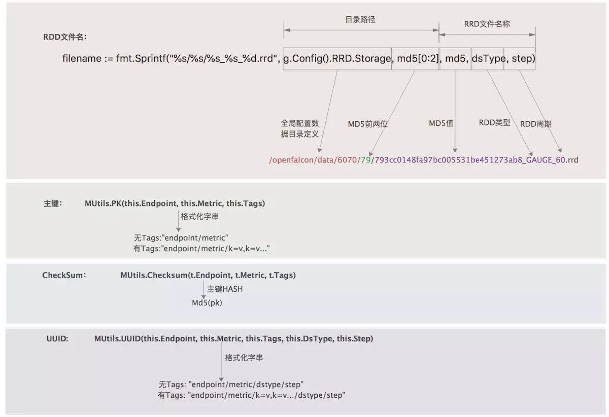

[TOC]

# Graph

## 职责

Graph将采集与传送组件每次push上来的数据，进行采样存储，并提供查询接口。

## code

```go
//main.go
func main() {
	cfg := flag.String("c", "cfg.json", "specify config file")
	version := flag.Bool("v", false, "show version")
	versionGit := flag.Bool("vg", false, "show version and git commit log")

	flag.Parse()

	if *version {
		fmt.Println(g.VERSION)
		os.Exit(0)
	}
	if *versionGit {
		fmt.Println(g.VERSION, g.COMMIT)
		os.Exit(0)
	}

	// global config
	g.ParseConfig(*cfg)
	g.InitApolloConfig()

	if g.Config().Debug {
		g.InitLog("debug")
	} else {
		g.InitLog("info")
		gin.SetMode(gin.ReleaseMode)
	}

	// rrdtool init
	rrdtool.InitChannel()
	// rrdtool before api for disable loopback connection
	rrdtool.Start()
	// start api
	go api.Start()
	// start indexing
	index.Start()
	// start http server
	go http.Start()
	go cron.CleanCache()

	start_signal(os.Getpid(), g.Config())
}

// 系统信息注册、处理与资源回收（实现优雅的关闭系统）
func start_signal(pid int, cfg *g.GlobalConfig) {
    sigs := make(chan os.Signal, 1)  //创建传送信号channal
    log.Println(pid, "register signal notify")
    signal.Notify(sigs, syscall.SIGINT, syscall.SIGTERM, syscall.SIGQUIT) //注册系统信号通知

    for {
        s := <-sigs   //接收系统信息号
        log.Println("recv", s)

        switch s {
        //处理信号类型
        case syscall.SIGINT, syscall.SIGTERM, syscall.SIGQUIT:
            log.Println("graceful shut down")
            if cfg.Http.Enabled {   //关闭Http
                http.Close_chan <- 1
                <-http.Close_done_chan
            }
            log.Println("http stop ok")

            if cfg.Rpc.Enabled {   //关闭RPC
                api.Close_chan <- 1
                <-api.Close_done_chan
            }
            log.Println("rpc stop ok")
            
            //rrd退出存盘
            rrdtool.Out_done_chan <- 1
            rrdtool.FlushAll(true)   
            log.Println("rrdtool stop ok")

            log.Println(pid, "exit")
            os.Exit(0)
        }
    }
}

func InitChannel() {
    Out_done_chan = make(chan int, 1)     //退出信号Channel
    ioWorkerNum := g.Config().IOWorkerNum  //IO worker数
    //创建与初始化指定IOWorker数量的Channel
    io_task_chans = make([]chan *io_task_t, ioWorkerNum) 
    for i := 0; i < ioWorkerNum; i++ {
        io_task_chans[i] = make(chan *io_task_t, 16) 
    }
}
```

rrdtool.Start() rrdTool服务启动 :

```go
func Start() {
    cfg := g.Config()
    var err error
    // 检测data_dir,确保可读写权限
    if err = file.EnsureDirRW(cfg.RRD.Storage); err != nil {
        log.Fatalln("rrdtool.Start error, bad data dir "+cfg.RRD.Storage+",", err)
    }

    migrate_start(cfg)  //迁移数据线程，监听与处理NET_TASK_M_XXX任务
                        //主要功能Send/query/pull RRD数据
    go syncDisk()       //同步缓存(GraphItemsMap)至磁盘RRD文件
    go ioWorker()       //IO工作线程，监听与处理IO_TASK_M_XXX任务
                        //主要功能Read/write/flush RRD文件
    log.Println("rrdtool.Start ok")
}
```

CheckSum计算

```go
checksum := items[i].Checksum()   //每个item Checksum计算

func (t *GraphItem) Checksum() string {
    return MUtils.Checksum(t.Endpoint, t.Metric, t.Tags)
}

//Checksum计算函数实现（字符串化->MD5）
// MD5(主键)
func Checksum(endpoint string, metric string, tags map[string]string) string {
    pk := PK(endpoint, metric, tags)  //字符串化 (PrimaryKey)  return Md5(pk)                        //md5 hash
}

# 主键（PrimaryKey）
# Item Checksum 字符串化规则
#   无Tags:"endpoint/metric"
#   有Tags:"endpoint/metric/k=v,k=v..."
func PK(endpoint, metric string, tags map[string]string) string {
    ret := bufferPool.Get().(*bytes.Buffer)
    ret.Reset()
    defer bufferPool.Put(ret)

    if tags == nil || len(tags) == 0 {  //无tags
        ret.WriteString(endpoint)
        ret.WriteString("/")
        ret.WriteString(metric)

        return ret.String()
    }
    ret.WriteString(endpoint)
    ret.WriteString("/")
    ret.WriteString(metric)
    ret.WriteString("/")
    ret.WriteString(SortedTags(tags))
    return ret.String()
}

## 字符串化Tags项 （补图）
func SortedTags(tags map[string]string) string {
    if tags == nil {
        return ""
    }

    size := len(tags)

    if size == 0 {
        return ""
    }

    ret := bufferPool.Get().(*bytes.Buffer)
    ret.Reset()
    defer bufferPool.Put(ret)

    if size == 1 {                 //tags长度为1个时字串格式
        for k, v := range tags {
            ret.WriteString(k)
            ret.WriteString("=")
            ret.WriteString(v)
        }
        return ret.String()
    }

    keys := make([]string, size)  //缓存tags Key slice
    i := 0
    for k := range tags {
        keys[i] = k
        i++
    }

    sort.Strings(keys)

    for j, key := range keys {   //tags长度>1个时字串格式
        ret.WriteString(key)
        ret.WriteString("=")
        ret.WriteString(tags[key])
        if j != size-1 {
            ret.WriteString(",") //"k=v,k=v..."
        }
    }

    return ret.String()
}

# MD5 hash
func Md5(raw string) string {
    h := md5.Sum([]byte(raw))
    return hex.EncodeToString(h[:])
}
```



RRD key名生成与解析 、 RRD文件名计算 

```go
key := g.FormRrdCacheKey(checksum, dsType, step) //生成Key名称，用于采集Item数据缓存内存唯一标识和RRD文件名生成

// 生成rrd缓存数据的key Name
// md5,dsType,step -> "md5_dsType_step"
func FormRrdCacheKey(md5 string, dsType string, step int) string {
    return md5 + "_" + dsType + "_" + strconv.Itoa(step)
}

// 反解析rrd Key名
// "md5_dsType_step" -> md5,dsType,step
func SplitRrdCacheKey(ckey string) (md5 string, dsType string, step int, err error) {
    ckey_slice := strings.Split(ckey, "_") //分割字符串
    if len(ckey_slice) != 3 {
        err = fmt.Errorf("bad rrd cache key: %s", ckey)
        return
    }

    md5 = ckey_slice[0]    //第一段:md5
    dsType = ckey_slice[1] //第二段:dsType
    stepInt64, err := strconv.ParseInt(ckey_slice[2], 10, 32)
    if err != nil {
        return
    }
    step = int(stepInt64)  //第三段:step
    
    err = nil
    return
}

// RRDTOOL UTILS
// 监控数据对应的rrd文件名称
// "baseDir/md5[0:2]/md5_dsType_step.rrd"
func RrdFileName(baseDir string, md5 string, dsType string, step int) string {
    return baseDir + "/" + md5[0:2] + "/" +
        md5 + "_" + dsType + "_" + strconv.Itoa(step) + ".rrd"
}
```

UUID 和 MD5(UUID)计算

```go
uuid := item.UUID() //UUID用于索引缓存的元素数据唯一标识

func (this *GraphItem) UUID() string {
    return MUtils.UUID(this.Endpoint, this.Metric, this.Tags, this.DsType, this.Step)
}

func UUID(endpoint, metric string, tags map[string]string, dstype string, step int) string {
    ret := bufferPool.Get().(*bytes.Buffer)
    ret.Reset()
    defer bufferPool.Put(ret)
    
    //无tags UUID格式
    //"endpoint/metric/dstype/step"
    if tags == nil || len(tags) == 0 {  
        ret.WriteString(endpoint)
        ret.WriteString("/")
        ret.WriteString(metric)
        ret.WriteString("/")
        ret.WriteString(dstype)
        ret.WriteString("/")
        ret.WriteString(strconv.Itoa(step))

        return ret.String()
    }     
    //有tags UUID格式
    // "endpoint/metric/k=v,k=v.../dstype/step"
    ret.WriteString(endpoint)
    ret.WriteString("/")
    ret.WriteString(metric)
    ret.WriteString("/")
    ret.WriteString(SortedTags(tags))
    ret.WriteString("/")
    ret.WriteString(dstype)
    ret.WriteString("/")
    ret.WriteString(strconv.Itoa(step))

    return ret.String()
}

# MD5(UUID)
func ChecksumOfUUID(endpoint, metric string, tags map[string]string, dstype string, step int64) string {
    return Md5(UUID(endpoint, metric, tags, dstype, int(step)))
}
```