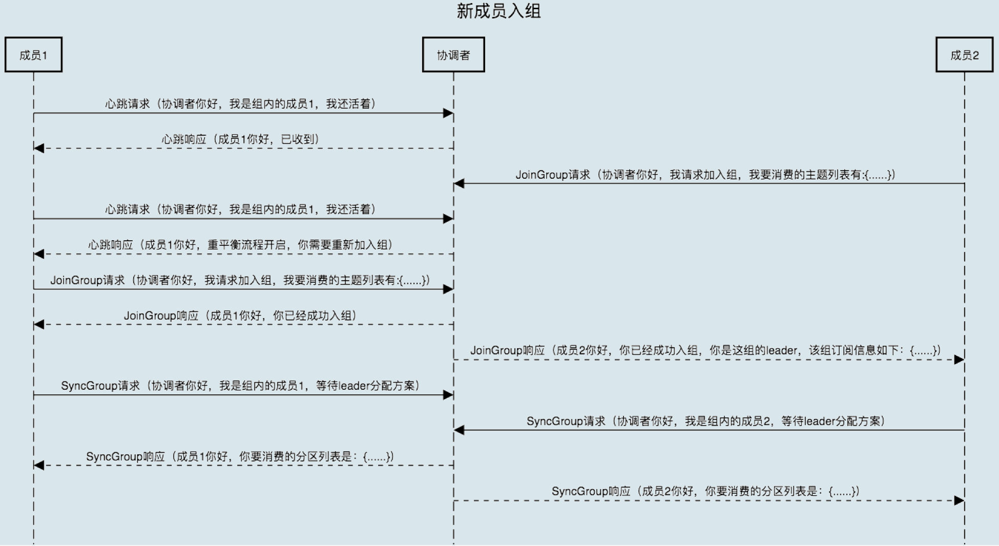
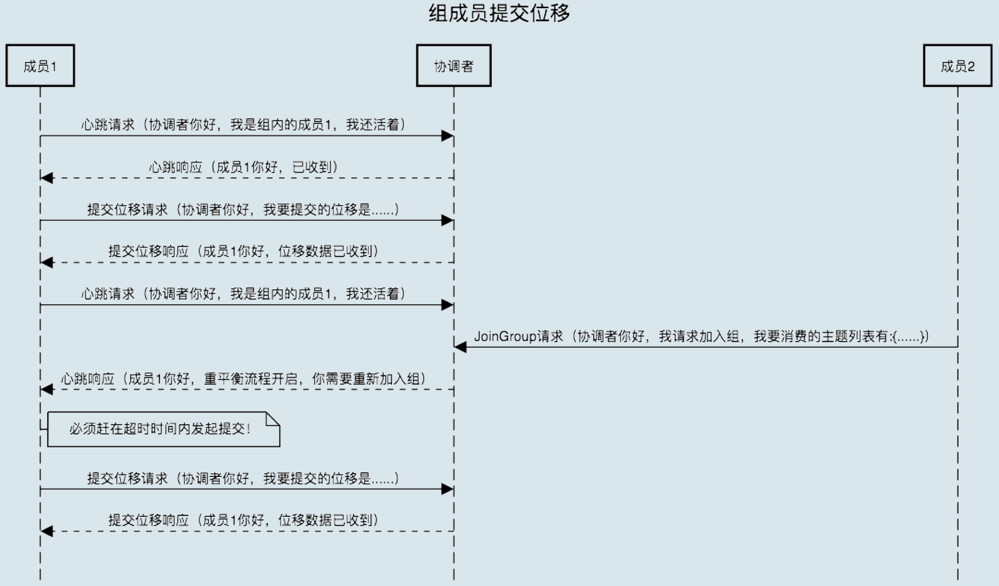
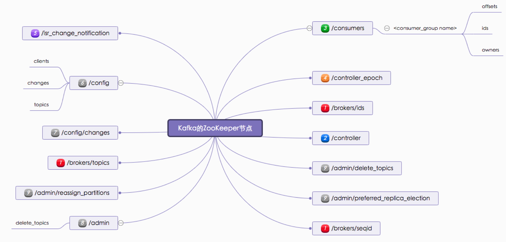
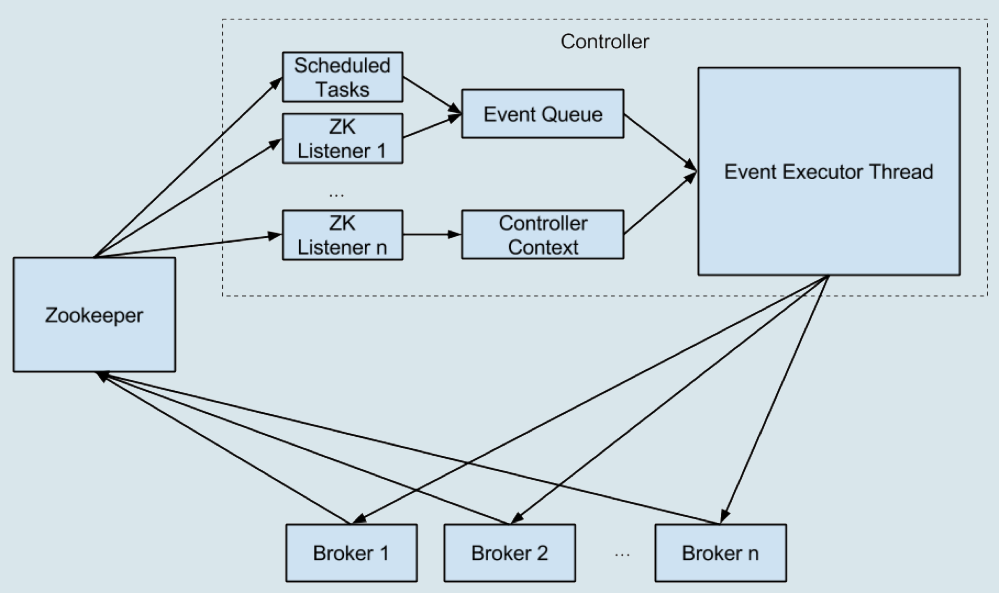
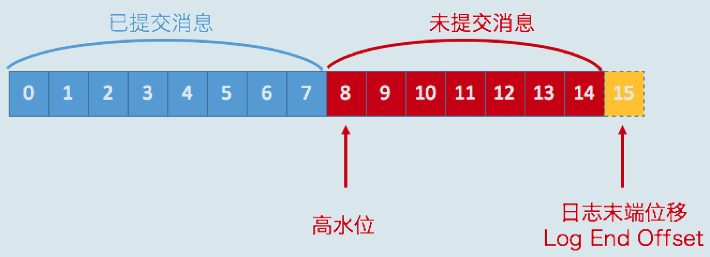
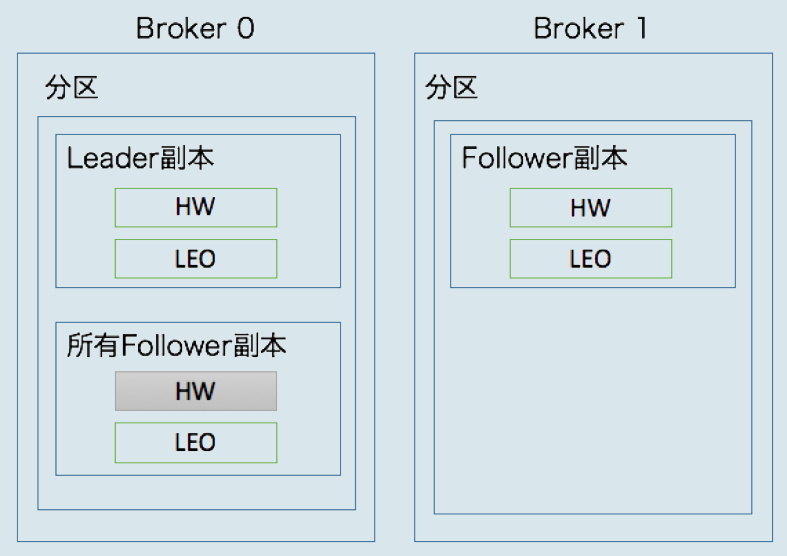

[TOC]

## 基础

消息引擎能够有效地对抗上游的流量冲击，真正做到将上游的“峰”填满到“谷”中，避免了流量的震荡。消息引擎系统的另一大好处在于发送方和接收方的松耦合，这也在一定程度上简化了应用的开发，减少了系统间不必要的交互。

在 Kafka 中，发布订阅的对象是主题（Topic），可以为每个业务，每类数据都创建专属的主题。向主题发布消息的客户端应用程序称为生产者（Producer），生产者程序通常持续不断地向一个或多个主题发送消息，而订阅这.些主题消息的客户端应用程序就被称为消费者（Consumer）。把生产者和消费者统称为客户端（Clients）。Kafka 的服务器端由被称为 Broker 的服务进程构成，Broker 负责接收和处理客户端发送过来的请求，以及对消息进行持久化。

Kafka 定义了两类副本：领导者副本（Leader Replica）和追随者副本（Follower Replica）。生产者总是向领导者副本写消息；而消费者总是从领导者副本读消息。至于追随者副本，它只做一件事：向领导者副本发送请求，请求领导者把最新生产的消息发给它，这样它能保持与领导者的同步。

倘若领导者副本积累了太多的数据以至于单台 Broker 机器都无法容纳了，此时应该怎么办呢？

- 分区（Partitioning）：把数据分割成多份保存在不同的 Broker 上。

- 将每个主题划分成多个分区（Partition），每个分区是一组有序的消息日志。生产者生产的每条消息只会被发送到一个分区中，Kafka 的分区编号是从 0 开始的，如果 Topic 有100 个分区，那么它们的分区号就是从 0 到 99。

- 副本是在分区这个层级定义的。每个分区下可以配置若干个副本，其中只能有 1 个领导者副本和 N-1 个追随者副本。

  每条消息在分区中的位置信息由一个叫位移（Offset）的数据来表征。分区位移总是从 0 开始。

  1. 第一层是主题层，每个主题可以配置 M 个分区，而每个分区又可N个副本。
  2. 第二层是分区层，每个分区的 N 个副本中只能有一个充当领导者。
  3. 第三层是消息层，分区中包含若干条消息，每条消息的位移从 0开始，依次递增。
  4.  最后，客户端程序只能与分区的领导者副本进行交互。

Kafka 使用消息日志（Log）来保存数据，一个日志就是磁盘上一个只能追加写（Append-only）消息的物理.文件。因为只能追加写入，故避免了缓慢的随机 I/O 操作，改为性能较好的顺序 I/O 写操作，这也是实现 Kafka 高.吞吐量特性的一个重要手段。在 Kafka 底层，一个日志又近一步细分成多个日志段，消息被追加写到当前最新的日志段中，当写满了一个日志段后，Kafka 会自动切分出一个新的日志段，并将老的日志段封存起来。后台还有定时任务会定期地检查老的日志段是否能够被删除，从而实现回收磁盘空间的目的。

点对点指的是同一条消息只能被下游的一个消费者消费，在 Kafka 中实现这种 P2P 模型的方法就是引入了消费者组，消费者组，指的是多个消费者实例共同组成一个组来消费一组主题。这组主题中的每个分区都只会被组内的一个消费者实例消费，其他消费者实例不能消费它。主要是为了提升消费者端的吞吐量。

重平衡（Rebalance）：假设组内某个实例挂掉了，Kafka 能够自动检测到，然后把这个 Failed 实例之前负责的分区转移给其他活着的消费者。

每个消费者在消费消息的过程中必然需要有个字段记录它当前消费到了分区的哪个位置上，这个字段就是消费者位移（Consumer Offset）,是消费者消费进度的指示器。

**为什么 Kafka 不像 MySQL 那样允许追随者副本对外提供读服务？**

1. kafka的分区已经让读是从多个broker读从而负载均衡，不是MySQL的主从，压力都在主上。
2. 如果从kafka的follower读，消费端offset控制更复杂。

## 常用版本

Apache Kafka:版本迭代速度最快,劣势在于它仅仅提供最最基础的组件，社区版 Kafka 只提供一种连接器，即读写磁盘文件的连接器,而没有与其他外部系统交互的连接器,没有提供任何监控框架或工具。目前有一些开源的监控框架可以帮助用于监控 Kafka（比如 Kafka manager）。总而言之，如果仅仅需要一个消息引擎系统亦或是简单的流处理应用场景，同时需要对系统有较大把控度，那么推荐使用Apache Kafka.迭代速度快，社区响应度高，使用它可以让你有更高的把控度；缺陷在于仅提供基础核心组件，缺失一些高级的特性。

Confluent Kafka:免费版还包含 Schema 注册中心和 REST proxy,前者是帮助你集中管理 Kafka 消息格式以实现数据前向 /后向兼容，后者用开放 HTTP 接口的方式允许你通过网络访问 Kafka 的各种功能，除此之外，免费版包含了更多的连接器。企业版，最有用的当属跨数据中心备份和集群监控两大功能了。多个数据中心之间数据的同步以及对集群的监控历来是Kafka 的痛点。它集成了很多高级特性且由 Kafka 原班人马打造，质量上有保证，但是公司暂时没有发展国内业务的计划，相关的资料以及技术支持都很欠缺。

CDH/HDP Kafka：便捷化的界面操作将 Kafka 的安装、运维、管理、监控全部统一在控制台中，所有的操作都可以在前端 UI 界面上完成，而不必去执行复杂的kafka命令。这些平台提供的监控界面也非常友好，你通常不需要进行任何配置就能有效地监控 Kafka，操作简单，节省运维成本，但是直接降低了对 Kafka 集群的掌控程度，对下层的 Kafka 集群一无所知，怎么能做到心中有数呢。另一个弊端在于它的滞后性。

## 主要演进版本

版本号：大 + 小 + patch

0.7版本:只有基础消息队列功能，无副本；打死也不使用

0.8版本:增加了副本机制，能够比较好地做到消息无丢失.新的producer API,需要指定 Broker 地址的 Produce而非ZooKeeper 的地址；建议使用0.8.2.2版本，因为该版本中老版本消费者 API 是比较稳定的；不建议使用0.8.2.0之后的producer API。建议使用0.8.2.2版本；不建议使用0.8.2.0之后的producer API

0.9版本:增加权限和认证，新的consumer API；还引入了 Kafka Connect 组件用于实现高性能的数据抽取。不建议使用consumer API；

0.10版本:引入Kafka Streams功能，bug修复；建议版本0.10.2.2；建议使用新版consumer API

0.11版本:producer API幂等，事物API，消息格式重构；建议版本0.11.0.3；谨慎对待消息格式变化

1.0和2.0版本:Kafka Streams改进；建议版本2.0；

## 集群

Kafka 由 Scala 语言和 Java 语言编写而成，编译之后的源代码就是普通的“.class”文件。

### 参数

需要配置存储信息的，即 Broker 使用哪些磁盘：

- log.dirs：这是非常重要的参数，指定了 Broker需要使用的若干个文件目录路径。这个参数是没有默认值的这说明它必须亲自指定。具体格式是一个 CSV 格式，如/home/kafka1,/home/kafka2,/home/kafka3这样。如果有条件的话你最好保证这些目录挂载到不同的物理磁盘上。

  1. 提升读写性能：比起单块磁盘，多块物理磁盘同时读写数据有更高的吞吐量。

  2. 自 1.1 开始，坏掉的磁盘上的数据会自动地转移到其他正常的磁盘上。

- log.dir：表示单个路径，它是补充上一个参数用的。

  --------

  ZooKeeper 相关的设置:负责协调管理并保存 Kafka 集群的所有元数据信息，比如集群都有哪些 Broker 在运行、创建了哪些 Topic，每个 Topic 都有多少分区以及这些分区的 Leader 副本都在哪些机器上等信息。

  - zookeeper.connect。这也是一个 CSV 格式的参数，如zk1:2181,zk2:2181,zk3:2181。2181 是 ZooKeeper 的默认端口。chroot 是 ZooKeeper 的概念，类似于别名。如果有两套 Kafka 集群分别叫 kafka1 和 kafka2，那么两套集群的zookeeper.connect参数可以这样指定：zk1:2181,zk2:2181,zk3:2181/kafka1和zk1:2181,zk2:2181,zk3:2181/kafka2。切记 chroot 只需要写一次，而且是加到最后的。

--------

与 Broker 连接相关的，即客户端程序或其他 Broker 如何与该 Broker 进行通信的设置。有以下三个参数：

- listeners：学名叫监听器，告诉外部连接者要通过什么协议访问指定主机名和端口开放的 Kafka 服务。<协议名称，主机名，端口号>.。协议名称可能是标准的名字，如 PLAINTEXT 、SSL 也可能是你自己定义的协议名字，比如CONTROLLER: //localhost:9092.(自己定的协议名称要指定listener.security.protocol.map参数告诉这个协议底层使用了哪种安全协议，比如listener.security.protocol.map=CONTROLLER:PLAINTEXT表示CONTROLLER这个自定义协议底层使用明文不加密传输数据。）
- advertised.listeners：和 listeners 相比多了个 advertised。Advertised 的含义表示宣称的、公布的，就是说这组监听器是 Broker 用于对外发布的。

------

关于 Topic 管理的:

- auto.create.topics.enable：是否允许自动创建 Topic。要为名为 test 的 Topic 发送事件，但是不小心拼写错误了，把 test 写成了 tst，之后启动了生产者程序结果一个名为 tst 的 Topic 就被自动创建了。最好设置成 false，

- unclean.leader.election.enable：由于只有保存数据比较多的那些副本才有资格竞选，那些落后进度太多的副本没资格做这件事。如果设置成 false，那么就坚持之前的原则，坚决不能让那些落后太多的副本竞选 Leader。这样做的后果是这个分区就不可用了，因为没有 Leader 了。反之如果是 true，那么 Kafka 允许你从那些“跑得慢”的副本中选一个出来当 Leader。这样做的后果是数据有可能就丢失了。

- auto.leader.rebalance.enable：是否允许定期进行 Leader 选举。换一次 Leader 代价很高的，而且这种换 Leader 本质上没有任何性能收益，因此建议设置成 false。

  ---------

  数据留存方面的:

- log.retention.{hour|minutes|ms}：控制一条消息数据被保存多长时间。从优先级上来说 ms 设置最高、minutes 次之、hour 最低。比如log.retention.hour=168表示默认保存 7 天的数据.
- log.retention.bytes：这是指定 Broker 为消息保存的总磁盘容量大小。这个值默认是 -1，表明你想在这台 Broker 上保存多少数据都可以.
- message.max.bytes：控制 Broker 能够接收的最大消息大小。

-------

Topic 级别参数:

- retention.ms：规定了该 Topic 消息被保存的时长。默认是 7 天，即该 Topic 只保存最近 7 天的消息。一旦设置了这个值，它会覆盖掉 Broker 端的全局参数值。
- retention.bytes：规定了要为该 Topic 预留多大的磁盘空间。当前默认值是 -1.

设置 Topic 级别参数:创建 Topic 时进行设置，修改 Topic 时设置。

```java
//请注意结尾处的--config设置，我们就是在 config 后面指定了想要设置的 Topic 级别参数：
bin/kafka-topics.sh --bootstrap-server localhost:9092 --create --topic transaction --partitions 1 --replication-factor 1 --config retention.ms=15552000000 --config max.message.bytes=5242880
    
//使用另一个自带的命令kafka-configs来修改 Topic 级别参数。
bin/kafka-configs.sh --zookeeper localhost:2181 --entity-type topics --entity-name transaction --alter --add-config max.message.bytes=10485760
```

----

JVM参数：Kafka Broker 在与客户端进行交互时会在 JVM 堆上创建大量的 ByteBuffer 实例，Heap Size 不能太小。如果 Broker 所在机器的 CPU 资源非常充裕，建议使用 CMS 收集器。启用方法是指定-XX:+UseCurrentMarkSweepGC。否则，使用吞吐量收集器。开启方法是指定-XX:+UseParallelGC。当然了，如果你已经在使用 Java ９了，那么就用默认的 G1 收集器就好了。

- KAFKA_HEAP_OPTS：指定堆大小。
- KAFKA_JVM_PERFORMANCE_OPTS ：指定 GC 参数。
- 最后是提交时间或者说是 Flush 落盘时间。向 Kafka 发送数据并不是真要等数据被写入磁盘才会认为成功，而是只要数据被写入到操作系统的页缓存（Page Cache）上就可以了，随后操作系统根据 LRU 算法会定期将页缓存上的“脏”数据落盘到物理磁盘上。这个定期就是由提交时间来确定的，默认是 5 秒。一般情况下认为这个时间太频繁了，可以适当地增加提交间隔来降低物理磁盘的写操作。
- swap 的调优：一旦设置成 0，当物理内存耗尽时，操作系统会触发 OOM killer 这个组件，它会随机挑选一个进程然后 kill 掉，不给用户任何的预警。但如果设置成一个比较小的值，当开始使用 swap 空间时，你至少能够观测到 Broker 性能开始出现急剧下降，从而给你进一步调优和诊断问题的时间。建议将 swappniess 配置成一个接近 0 但不为 0 的值，比如 1。

## 客户端原理

为什么使用分区的概念而不是直接使用多个主题呢？

不同的分区能够被放置到不同节点的机器上，而数据的读写操作也都是针对分区这个粒度而进行的，这样每个节点的机器都能独立地执行各自分区的读写请求处理。并且，我们还可以通过添加新的节点机器来增加整体系统的吞吐量。

分区策略：决定生产者将消息发送到哪个分区的算法。有默认的分区策略，同时它也支持自定义分区策略。自定义分区策略，你需要显式地配置生产者端的参数partitioner.class。首先类要实现org.apache.kafka.clients.producer.Partitioner接口（只定义了两个方法：partition()和close()）

```java
int partition(String topic, Object key, byte[] keyBytes, Object value, byte[] valueBytes, Cluster cluster);

```

**轮询策略**：即顺序分配。比如一个主题下有 3 个分区，那么第一条消息被发送到分区 0，第二条被发送到分区 1，第三条被发送到分区 2，以此类推。当生产第 4 条消息时又会重新开始。轮询策略是 Kafka Java 生产者 API 默认提供的策略。

**随机策略**:也称 Randomness 策略。所谓随机就是我们随意地将消息放置到任意一个分区上。随机策略是老版本生产者使用的分区策略，在新版本中已经改为轮询策略。

```java
List<PartitionInfo> partitions = cluster.partitions ForTopic(topic);
return ThreadLocalRandom.current().nextInt(partitions.size());
```

**按消息键保序策略**：Kafka 允许为每条消息定义消息键，一旦消息被定义了 Key，那么你就可以保证同一个 Key 的所有消息都进入到相同的分区里面。

```java
List<PartitionInfo> partitions = cluster.partitionsForTopic(topic);
return Math.abs(key.hashCode()) % partitions.size();
```

目前 Kafka 共有两大类消息格式，社区分别称之为 V1 版本和 V2 版本。V2 版本是 Kafka 0.11.0.0 中正式引入的。不论是哪个版本，Kafka 的消息层次都分为两层：消息集合（message set）以及消息（message）。一个消息集合中包含若干条日志项（record item）。

原来在 V1 版本中，每条消息都需要执行 CRC 校验，但有些情况下消息的 CRC 值是会发生变化的。比如在 Broker 端可能会对消息时间戳字段进行更新，再比如 Broker 端在执行消息格式转换时（主要是为了兼容老版本客户端程序）。因此在 V2 版本中，消息的 CRC 校验工作就被移到了消息集合这一层。

之前 V1 版本中保存压缩消息的方法是把多条消息进行压缩然后保存到外层消息的消息体字段中；而 V2 版本的做法是对整个消息集合进行压缩。显然后者应该比前者有更好的压缩效果。

```java
 Properties props = new Properties();
 props.put("bootstrap.servers", "localhost:9092");
 props.put("acks", "all");
 props.put("key.serializer", "org.apache.kafka.common.serialization.StringSerializer");
 props.put("value.serializer", "org.apache.kafka.common.serialization.StringSerializer");
 //compression.type 参数即表示启用指定类型的压缩算法,这样Producer启动后生产的每个消息集合都是经GZIP压缩，
 props.put("compression.type", "gzip");
 
 Producer<String, String> producer = new KafkaProducer<>(props);

```

大部分情况下 Broker 从 Producer 端接收到消息后仅仅是原封不动地保存而不会对其进行任何修改，有两种例外情况就可能让 Broker 重新压缩消息。

1. Broker 端指定了和 Producer 端不同的压缩算法。Broker 端也有一个参数叫 compression.type，但是这个参数的默认值是 producer。可一旦在 Broker 端设置了不同的，可能会发生预料之外的压缩 / 解压缩操作，通常表现为 Broker 端 CPU 使用率飙升。
2. Broker 端发生了消息格式转换。

通常来说解压缩发生在消费者程序中，Kafka 会将启用了哪种压缩算法封装进消息集合中。每个压缩过的消息集合在 Broker 端写入时都要发生解压缩操作，目的就是为了对消息执行各种验证。

在吞吐量方面：LZ4 > Snappy > zstd 和和 GZIP；而在压缩比方面，zstd > LZ4 > GZIP > Snappy。具体到物理资源，使用 Snappy占用的网络带宽最多，zstd 最少；在 CPU 使用率方面，各个算法表现得差不多。

Kafka 只对“已提交”的消息（committed message）做有限度的持久化保证。

当 Kafka 的若干个 Broker 成功地接收到一条消息并写入到日志文件后，它们会告诉生产者程序这条消息已成功提交此时，这条消息在 Kafka 看来就正式变为“已提交”消息了。

“消息丢失”案例：

1. Kafka Producer 是异步发送消息的，也就是说如果你调用的是 producer.send(msg) 这个 API(属于典型的“fire and forget”)，那么它通常会立即返回，但此时你不能认为消息发送已成功完成。Producer 永远要使用带有回调通知的发送 API:producer.send(msg, callback).
   - 设置 acks = all。acks 是 Producer 的一个参数，代表了你对“已提交”消息的定义。如果设置成all，则表明所有副本 Broker 都要接收到消息，该消息才算是“已提交”。这是最高等级的“已提交”定义。

2. 维持先消费消息（阅读），再更新位移（书签）的顺序，这种处理方式可能带来的问题是消息的重复处理。
   - 设置 retries 为一个较大的值。这里的 retries 同样是 Producer 的参数，当出现网络的瞬时抖动时，消息发送可能会失败，此时配置了 retries > 0 的 Producer 能够自动重试消息发送，避免消息丢失。
   - 设置 replication.factor >= 3。Broker 端的参数。其实这里想表述的是，最好将消息多保存.
   - 设置 min.insync.replicas > 1。是 Broker 端参数，控制的是消息至少要被写入到多少个副本才算是“已提交”。设置成大于 1 可以提升消息持久性。在实际环境中千万不要使用默认值 1。
   - 确保 replication.factor > min.insync.replicas。如果两者相等，那么只要有一个副本挂机，整个分区就无法正常工作了。
   - Consumer 端有个参数 enable.auto.commit，最好把它设置成 false，并采用手动提交位移的方式.

3. Consumer 程序从 Kafka 获取到消息后开启了多个线程异步处理消息，而 Consumer 程序自动地向前更新位移。假如其中某个线程运行失败了，它负责的消息没有被成功处理，但位移已经被更新了，因此这条消息对于 Consumer 而言是丢失了。解决方案也很简单：如果是多线程异步处理消费消息，Consumer 程序不要开启自动提交位移，而是要应用程序手动提交位移。

### Kafka 拦截器

生产者拦截器允许你在发送消息前以及消息提交成功后植入你的拦截器逻辑；而消费者拦截器支持在消费消息前以及提交位移后编写特定逻辑。

interceptor.classes，它指定的是一组拦截器实现类.

```java
//在 Producer 端指定拦截器：
Properties props = new Properties()
List<String> interceptors = new ArrayList<>();
interceptors.add("com.yourcompany.kafkaproject.interceptors.AddTimestampInterceptor"); // 拦截器 1
interceptors.add("com.yourcompany.kafkaproject.interceptors.UpdateCounterInterceptor"); // 拦截器 2
props.put(ProducerConfig.INTERCEPTOR_CLASSES_CONFIG, interceptors);
……
```

Producer 端拦截器实现类都要继承 org.apache.kafka.clients.producer.ProducerInterceptor 接口,有两个核心的方法:

1. onSend：该方法会在消息发送之前被调用。
2. onAcknowledgement：该方法会在消息成功提交或发送失败之后被调用(调用要早于 callback 的调用)。

消费者拦截器也是同样的方法，只是具体的实现类要实现 org.apache.kafka.clients.consumer.ConsumerInterceptor 接口，这里面也有两个核心的方法:

1. onConsume：该方法在消息返回给 Consumer 程序之前调用。
2. onCommit：Consumer 在提交位移之后调用该方法.

**指定拦截器类时要指定它们的全限定名.**

Kafka 的所有通信都是基于 TCP 的，而不是基于 HTTP.

```java
Properties props = new Properties ();
props.put(“参数 1”, “参数 1 的值”)；
props.put(“参数 2”, “参数 2 的值”)；
……
//建立与 Broker 的 TCP 连接。在创建 KafkaProducer 实例时，生产者应用会在后台创建并启动一个名为 Sender 的线程，该 Sender 线程开始运行时首先会创建与 Broker 的连接。
try (Producer<String, String> producer = new KafkaProducer<>(props)) {
            producer.send(new ProducerRecord<String, String>(……), callback);
	……
}
```

bootstrap.servers 参数。它是 Producer 的核心参数之一，指定了这个 Producer **启动时**要连接的 Broker 地址。如果为这个参数指定了 1000 个 Broker 连接信息，那么Producer 启动时会首先创建与这 1000 个 Broker 的 TCP 连接。不建议把集群中所有的 Broker 信息都配置到 bootstrap.servers 中，通常你指定 3～4 台就足以。因为 Producer 一旦连接到集群中的任一台 Broker，就能拿到整个集群的 Broker 信息（日志输出中的最后一行也很关键：它表明 Producer 向某一台 Broker 发送了 METADATA 请求，尝试获取集群的元数据信息——这就是Producer 能够获取集群所有信息的方法）。

KafkaProducer 类是线程安全的。KafkaProducer 实例创建的线程和前面提到的 Sender 线程共享的可变数据结构只有 RecordAccumulator 类，它主要的数据结构是一个 ConcurrentMap。

TCP 连接还**可能**在两个地方被创建：一个是在更新元数据后，另一个是在消息发送时。当 Producer 更新了集群的元数据信息之后，如果发现与某些 Broker 当前没有连接，那么它就会创建一个 TCP连接。同样地，当要发送消息时，Producer 发现尚不存在与目标 Broker 的连接，也会创建一个。

Producer 更新集群元数据信息的两个场景：

1. 当 Producer 尝试给一个不存在的主题发送消息时，Broker 会告诉 Producer 说这个主题不存在。此时 Producer 会发送 METADATA 请求给 Kafka 集群，去尝试获取最新的元数据信息。
2. Producer 通过 metadata.max.age.ms 参数定期地去更新元数据信息。该参数的默认值是 30000，即五分钟。

何时关闭 TCP 连接？

1. 主动关闭，甚至包括用户调用 kill -9 主动“杀掉”Producer 应用。当然最推荐的方式还是调用 producer.close() 方法来关闭。
2. Kafka 自动关闭。这与 Producer 端参数 connections.max.idle.ms 的值有关。默认情况下该参数值是 9 分钟.一旦被设置成 -1，TCP 连接将成为永久长连接。当然这只是软件层面的“长连接”机制，由于 Kafka 创建的这些 Socket 连接都开启了 keepalive，因此 keepalive 探活机制还是会遵守的。

-------

Kafka 对 Producer 和 Consumer 要处理的消息提供什么样的承诺。常见的承诺有以下三种：

1. 最多一次（at most once）：消息可能会丢失，但绝不会重新发送。
2. 至少一次（at least once）：消息不会丢失，但有可能会重新发送。
3. 精确一次（exactly once）：消息不会丢失，也不会被重新发送。即使 Producer 端重复发送了相同的消息，Broker 端也能做到自动去重。在下游 Consumer 看来，消息依然只有一条。

Kafka 默认提供的交付可靠性保障是第二种。Kafka 是怎么做到精确一次的呢？简单来说，这是通过两种机制：幂等性（Idempotence）和事务（Transaction）。

1. 指定 Producer 幂等性的方法很简单，仅需要设置一个参数即可，即 props.put(“enable.idempotence”, ture)，或 props.put(ProducerConfig.ENABLE_IDEMPOTENCE__CONFIG， true)。用空间去换时间的优化思路，即在 Broker 端多保存一些字段。当 Producer 发送了具有相同字段值的消息后，Broker 能够自动知晓这些消息已经重复了，于是可以在后台丢弃。而且只能保证单分区上的幂等性，且在Producer 进程的一次运行。当重启了 Producer 进程，这种幂等性保证就丧失了。

2. 事务型 Producer 能够保证将消息原子性地写入到多个分区.

   - 开启 enable.idempotence = true
   - 设置 Producer 端参数 transactional.id

   实际上即使写入失败，Kafka 也会把它们写入到底层的日志中，因此在 Consumer 端，设置 isolation.level 参数：

   - read_uncommitted：这是默认值，表明 Consumer 能够读取到 Kafka 写入的任何消息，不论事务型Producer 提交事务还是终止事务，其写入的消息都可以读取。
   - read_committed：表明 Consumer 只会读取事务型 Producer 成功提交事务写入的消息。

   消费者组它们共享一个公共的 ID，组内的所有消费者协调在一起来消费订阅主题的所有分区。每个分区只能由同一个消费者组内的一个 Consumer 实例来消费。Kafka 仅仅使用 Consumer Group 这一种机制，却同时实现了传统消息引擎系统的两大模型：如果所有实例都属于同一个 Group，那么它实现的就是消息队列模型；如果所有实例分别属于不同的 Group，那么它实现的就是发布 / 订阅模型。

   理想情况下，Consumer 实例的数量应该等于该Group 订阅主题的分区总数。

   ------

   老版本的 Consumer Group 把位移保存在 ZooKeeper 中。ZooKeeper 这类元框架其实并不适合进行频繁的写更新，而 Consumer Group 的位移更新却是一个非常频繁的操作。这种大吞吐量的写操作会极大地拖慢 ZooKeeper集群的性能。

   在新版本的 Consumer Group 中，将位移保存在 Kafka 内部主题：__consumer_offsets。位移主题的 Key 中应该保存 3 部分内容：Group ID，主题名，分区号。值为保存了位移值，位移提交的一些其他元数据，诸如时间戳和用户自定义的数据等。

   当 Kafka 集群中的第一个 Consumer 程序启动时，Kafka 会自动创建位移主题。Broker 端参数 offsets.topic.num.partitions 的取值了。它的默认值是 50，因此 Kafka 会自动创建一个 50 分区的位移主题。副本数

   参数 offsets.topic.replication.factor的默认值是 3。

   Consumer 提交位移的方式有两种：自动提交位移和手动提交位移.Consumer 端有个参数叫 enable.auto.commit，如果值是 true，则 Consumer 在后台默默地为你定期提交位移，提交间隔由一个专属的参数 auto.commit.interval.ms 来控制。如果你选择的是自动提交位移，那么就可能存在一个问题：只要 Consumer 一直启动着，它就会无限期地向位移主题写入消息(因为有间隔时间).

   由于是自动提交位移，位移主题中会不停地写入位移 =100 的消息。显然 Kafka 只需要保留这类消息中的最新一条就可以了，之前的消息都是可以删除的。这就要求 Kafka 必须要有针对位移主题消息特点的消息删除策略:Compact策略

   对于同一个 Key 的两条消息 M1 和 M2，如果 M1的发送时间早于 M2，那么 M1 就是过期消息。Compact 的过程就是扫描日志的所有消息，剔除那些过期的消息，然后把剩下的消息整理在一起。Kafka 提供了专门的后台线程定期地巡检待 Compact的主题，看看是否存在满足条件的可删除数据。这个后台线程叫Log Cleaner。

   -------

   比如某个 Group 下有 20 个 Consumer 实例，它订阅了一个具有 100 个分区的 Topic。正常情况下，Kafka 平均会为每个 Consumer 分配 5 个分分区。这个分配的过程就叫 Rebalance。何时重平衡：

   1. 组成员数发生变更。比如有新的 Consumer 实例加入组或离开。
   2. 订阅主题数发生变更。Consumer Group 可以使用正则表达式的方式订阅主题，比如 consumer.subscribe(Pattern.compile(“t.*c”)) 就表明该 Group 订阅所有以字母 t 开头、字母 c 结尾的主题。在 Consumer Group 的运行过程中，新创建了一个满足这样条件的主题，那么该 Group 就会发生Rebalance。

   在 Rebalance 过程中，所有 Consumer 实例都会停止消费；还有可能重新创建连接其他 Broker 的 Socket 资源；而且Rebalance 实在是太慢了。

   ----

   协调者(Coordinator):负责为 Group 执行 Rebalance 以及提供位移管理和组成员管理等。Consumer 端应用程序在提交位移时，其实是向 Coordinator 所在的 Broker 提交位移。同样地，当Consumer 应用启动时，也是向 Coordinator负责执行消费者组的注册、成员管理记录等元数据管理操作。

   所有 Broker 在启动时，都会创建和开启相应的 Coordinator 组件。Kafka 为某个 Consumer Group 确定 Coordinator 所在的 Broker 的算法有 2 个步骤:

   1. 确定由位移主题的哪个分区来保存该 Group 数据：

      partitionId=Math.abs(groupId.hashCode()% offsetsTopicPartitionCount)

   2. 找出该分区 Leader 副本所在的 Broker，该 Broker 即为对应的 Coordinator。

   ----

   规避的那类“不必要 Rebalance”：

   1. 每个 Consumer 实例都会定期地向 Coordinator 发送心跳请求，表明它还存活着。如果某个 Consumer 实例不能及时地发送这些心跳请求，Coordinator就会认为该 Consumer 已经“死”了，从而将其从 Group 中移除，然后开启新一轮 Rebalance。Consumer 端有个参数，叫 session.timeout.ms，就是被用来表征此事的。该参数的默认值是 10 秒.

   2. heartbeat.interval.ms用来控制发送心跳请求频率。Coordinator 通知各个 Consumer 实例开启 Rebalance 的方法，就是将 REBALANCE_NEEDED 标志封装进心跳请求的响应体中。
   3. max.poll.interval.ms 参数。它限定了Consumer 端应用程序两次调用 poll 方法的最大时间间隔。它的默认值是 5 分钟，表示Consumer程序如果在 5 分钟之内无法消费完 poll 方法返回的消息，那么 Consumer 会主动发起“离开组”的请求，Coordinator 也会开启新一轮 Rebalance。
   4. Consumer 端出现了频繁的 Full GC 导致的长时间停顿，从而引发了 Rebalance。

   -------

   Consumer 的消费位移，它记录了 Consumer要消费的下一条消息的位移。从用户的角度来说，位移提交分为自动提交和手动提交；从 Consumer 端的角度来说，位移提交分为同步提交和异步提交。

   ```java
   Properties props = new Properties();
        props.put("bootstrap.servers", "localhost:9092");
        props.put("group.id", "test");
        props.put("enable.auto.commit", "true");
        props.put("auto.commit.interval.ms", "2000");
        props.put("key.deserializer", "org.apache.kafka.common.serialization.StringDeserializer");
        props.put("value.deserializer", "org.apache.kafka.common.serialization.StringDeserializer");
        KafkaConsumer<String, String> consumer = new KafkaConsumer<>(props);
        consumer.subscribe(Arrays.asList("foo", "bar"));
       while (true) {
            ConsumerRecords<String, String> records = consumer.poll(100);
            for (ConsumerRecord<String, String> record : records)
                System.out.printf("offset = %d, key = %s, value = %s%n", record.offset(), record.key(), record.value());
        }
   //手动提交位移
   while (true) {
               ConsumerRecords<String, String> records =
                           consumer.poll(Duration.ofSeconds(1));
               process(records); // 处理消息
               try {
                           consumer.commitSync();
               } catch (CommitFailedException e) {
                           handle(e); // 处理提交失败异常
               }
   }
   ```

   poll 方法的逻辑是先提交上一批消息的位移，再处理下一批息，因此它能保证不出现消费丢失的情况。但自动提交位移可能会出现重复消费。

   在调用 commitSync() 时，Consumer程序会处于阻塞状态，直到远端的 Broker 返回提交结果，这会影响整个应用程序的 TPS。因此还提供了KafkaConsumer#commitAsync()一个异步API。

   ```java
   //出现问题时它不会自动重试,因为可能已经有其它更大偏移量已经提交成功了,如果此时重试提交成功,那么更小的偏移量会覆盖大的偏移量。
   while (true) {
               ConsumerRecords<String, String> records = consumer.poll(Duration.ofSeconds(1));
               process(records); // 处理消息
               consumer.commitAsync((offsets, exception) -> {
                   if (exception != null)
                       handle(exception);
   	});
   }
   //结合两者
      try {
              while(true) {
                  ConsumerRecords<String,String> records=                           											 consumer.poll(Duration.ofSeconds(1));
                  process(records); // 处理消息
                  commitAysnc(); // 使用异步提交规避阻塞
               }
   } catch(Exception e) {
          handle(e); // 处理异常
   } finally {
               try {
                   consumer.commitSync(); // 最后一次提交使用同步阻塞式提交
   	} finally {
   	     consumer.close();
   }
   }
   //中间提交
   private Map<TopicPartition, OffsetAndMetadata> offsets = new HashMap<>();
   int count = 0;
   ……
   while (true) {
               ConsumerRecords<String, String> records = 
   	consumer.poll(Duration.ofSeconds(1));
               for (ConsumerRecord<String, String> record: records) {
                           process(record);  // 处理消息
                           offsets.put(new TopicPartition(record.topic(), record.partition()),
                                      new OffsetAndMetadata(record.offset() + 1)；
                          if（count % 100 == 0）
                                       consumer.commitAsync(offsets, null); // 回调处理逻辑是 null
                           count++;
   	}
   }
   
   ```

   

-----

CommitFailedException:本次提交位移失败了，原因是消费者组已经开启了 Rebalance 过程，并且将要提交位移的分区分配给了另一个消费者实例。因为连续两次调用 poll 方法的时间间隔超过了期望的 max.poll.interval.ms 参数值。

1. 增加 Consumer 端允许下游系统消费一批消息的最大时长.
2. 减少下游系统一次性消费的消息总数。这取决于 Consumer端参数 max.poll.records 的值。当前该参数的默认值是 500 条。

---

TCP 连接是在调用 KafkaConsumer.poll时创建的：

1. 发起 FindCoordinator 请求时。消费者程序会向集群中当前负载最小的那台 Broker 发送FindCoordinator 的请求。然后消费者复用了刚才创建的那个 Socket 连接，向 Kafkfka 集群发送元数据请求以获取整个集群的信息。
2. 连接协调者时。消费者知晓了真正的协调者后，会创建连向该 Broker 的Socket 连接。只有成功连入协调者，协调者才能开启正常的组协调操作，比如加入组、等待组分配方案、心跳请求处理、位移获取、位移提交等。
3. 消费数据时。消费者会为每个要消费的分区创建与该分区领导者副本所在 Broker 连接的 TCP。

何时关闭 TCP 连接？

1. 主动关闭，甚至包括用户调用 kill -9 主动“杀掉”Producer 应用。当然最推荐的方式还是调用 KafkaConsumer.close()方法来关闭。
2. Kafka 自动关闭。这与Consumer端参数 connections.max.idle.ms 的值有关。默认情况下该参数值是 9 分钟.

------

消费者 Lag 或 Consumer Lag:

Kafka 监控 Lag 的层级是在分区上的。

由于消费者的速度无法匹及生产者的速度，极有可能导致它消费的数据已经不在操作系统的页缓存中了，那么这些数据就会失去享有 Zero Copy 技术的资格。这样的话，消费者就不得不从磁盘上读取它们，这就进一步拉大了与生产者的差距，进而出现马太效应即那些 Lag 原本就很大的消费者会越来越慢.

怎么监控它呢？

1. 使用 Kafka 自带的命令行工具 kafka-consumer-groups 脚本。

   ```java
   bin/kafka-consumer-groups.sh --bootstrap-server <Kafka broker 连接信息 > --describe --group <group 名称 >
   ```

   

1.  使用 Kafka Java Cosumer API 编程。

   ```java
   public static Map<TopicPartition, Long> lagOf(String groupID, String bootstrapServers) throws TimeoutException {
           Properties props = new Properties();
           props.put(CommonClientConfigs.BOOTSTRAP_SERVERS_CONFIG, bootstrapServers);
           try (AdminClient client = AdminClient.create(props)) {
               //获取给定消费者组的最新消费消息的位移
               ListConsumerGroupOffsetsResult result = client.listConsumerGroupOffsets(groupID);
               try {
                   Map<TopicPartition, OffsetAndMetadata> consumedOffsets = result.partitionsToOffsetAndMetadata().get(10, TimeUnit.SECONDS);
                   props.put(ConsumerConfig.ENABLE_AUTO_COMMIT_CONFIG, false); // 禁止自动提交位移
                   props.put(ConsumerConfig.GROUP_ID_CONFIG, groupID);
                   props.put(ConsumerConfig.KEY_DESERIALIZER_CLASS_CONFIG, StringDeserializer.class.getName());
                   props.put(ConsumerConfig.VALUE_DESERIALIZER_CLASS_CONFIG, StringDeserializer.class.getName());
                   try (final KafkaConsumer<String, String> consumer = new KafkaConsumer<>(props)) {
                       //获取订阅分区的最新消息位移
                       Map<TopicPartition, Long> endOffsets = consumer.endOffsets(consumedOffsets.keySet());
                       return endOffsets.entrySet().stream().collect(Collectors.toMap(entry -> entry.getKey(),
                               entry -> entry.getValue() - consumedOffsets.get(entry.getKey()).offset()));
                   }
               } catch (InterruptedException e) {
                   Thread.currentThread().interrupt();
                   // 处理中断异常
                   // ...
                   return Collections.emptyMap();
               } catch (ExecutionException e) {
                   // 处理 ExecutionException
                   // ...
                   return Collections.emptyMap();
               } catch (TimeoutException e) {
                   throw new TimeoutException("Timed out when getting lag for consumer group " + groupID);
               }
           }
       }
   ```

   

2.  使用 Kafka 自带的 JMX监控指标。

   Kafka 消费者提供了一个名为 kafka.consumer-fetch-manager-metrics,client-id=“{client-id}”的 JMX 指标，有两组属性：records-lag-max 和 records-lead-min，它们分别表示此消费者在测试窗口时间内曾经达到的最大的 Lag 值和最小的 Lead 值。Lead 值是指消费者最新消费消息的位移与分区当前第一条消息位移的差值。

   lead越小意味着consumer消费的消息越来越接近被删除的边缘，显然是不好的

----

kafka内核

追随者副本是不对外提供服务的：

1. 方便实现“Read-your-writes”。否则有可能出现追随者副本还没有从领导者副本那里拉取到最新的消息，从而使得客户端看不到最新写入的消息。
2. 方便实现单调读（Monotonic Reads）。

In-sync Replicas（ISR）：ISR 中的副本都是与 Leader 同步的副本。Kafka 判断 Follower 是否与 Leader步的标准就是 Broker 端参数 replica.lag.time.max.ms 参数值。这个参数的含义是 Follower副本能够落后 Leader 副本的最长时间间隔，当前默认值是10秒。Kafka在启动的时候会开启两个任务，一个任务用来定期地检查是否需要缩减或者扩大ISR集合，这个周期是replica.lag.time.max.ms的一半，默认5000ms。当检测到ISR集合中有失效副本时，就会收缩ISR集合，当检查到有Follower的HighWatermark追赶上Leader时，就会扩充ISR。

除此之外，当ISR集合发生变更的时候还会将变更后的记录缓存到isrChangeSet中，另外一个任务会周期性地检查这个Set,如果发现这个Set中有ISR集合的变更记录，那么它会在zk中持久化一个节点。然后因为Controllr在这个节点的路径上注册了一个Watcher，所以它就能够感知到ISR的变化，并向它所管理的broker发送更新元数据的请求。最后删除该路径下已经处理过的节点。

----

Kafka 使用的是Reactor 模式处理请求：多个客户端会发送请求给到 Reactor。Reactor 有个请求分发线程 Dispatcher，也就是图中的 Acceptor，它会将不同的请求下发到多个工作线程中处理。


Kafka 的 Broker 端有个 SocketServer 组件，类似于 Reactor 模式中的 Dispatch，它也有对应的 Acceptor 线程和一个工作线程池，Broker 端参数 num.network.threads，用于调整该网络线程池的线程数。其默认值是 3，表示每台 Broker 启动时会创建 3 个网络线程，专门处理客户端发送的请求。Acceptor 线程采用轮询的方式将入站请求公平地发到所有网络线程中，


当网络线程拿到请求后，将请求放入到一个共享请求队列中。Broker 端还有个 IO线程池，负责从该队列中取出请求，执行真正的处理。如果是 PRODUCE 生产请求，则将消息写入到底层的磁盘日志中；如果是FETCH 请求，则从磁盘或页缓存中读取消息。Broker 端参数num.io.threads控制了这个线程池中的线程数。目前该参数默认值是 8.

请求队列是所有网络线程共享的，而响应队列则是每个网络线程专属的。

Purgatory 的组件是用来缓存延时请求（Delayed Request）的。所谓延时请求，就是那些一时未满足条件不能立刻处理的请求。

控制类请求有这样一种能力：它可以直接令数据类请求失效！假设我们有个主题只有 1 个分区，该分区配置了两个副本，其中Leader 副本保存在 Broker 0 上，Follow副本保存在 Broker 1 上。假设 Broker 0 这台机器积压了很多的 PRODUCE 请求，此时你如果使用 Kafka 命令强制将该主题分区的 Leader、Follow角色互换，那么 Kafka 内部的控制器组件（Controller）会发送 LeaderAndIsr 请求给 Broker 0，显式地告诉它，当前它不再是 Leader，而 Broker 1 上的 Follower 副本因为被选为新的 Leader，因此停止向 Broker 0 拉取消息。如果刚才积压的 PRODUCE 请求都设置了 acks=all，那么这些在 LeaderAndIsr 发送之前的请求会被暂存在 Purgatory 中不断重试，直到最终请求超时返回给客户端。

如果 Kafka 能够优先处理 LeaderAndIsr 请求，Broker 0 就会立刻抛出NOT_LEADER_FOR_PARTITION 异常，快速地标识这些积压 PRODUCE请求已失败，这样客户端不用等到 Purgatory 中的请求超时就能立刻感知，即使 acks 不是 all，积压的 PRODUCE 请求能成功写入 Leader 副本的日志，但处理 LeaderAndIsr 之后，Broker 0 上的 Leader 变为了Follower 副本，也要执行显式的日志截断。

为何不在 Broker 中实现一个优先级队列，并赋予控制类请求更高优先级？

它无法处理请求队列已满的情形。当请求队列已经无法容纳任何新的请求时，纵然有优先级之分，它也无法处理新的控制类请求了。社区的做法是Kafka Broker 启动后，会在后台分别两套创建网络线程池和 IO 线程池，它们分别处理数据类请求和控制类请求。至于所用的 Socket 端口，自然是使用不同的端口了，你需要提供不同的listeners 配置，显式地指定哪套端口用于处处理哪类请求。

----

重平衡过程是如何通知到其他消费者实例的？靠消费者端的心跳线程（Heartbeat Thread）。

当协调者决定开启新一轮重平衡后，它会将“REBALANCE_PROGRESS”封装进心跳请求的响应中，发还给消费者实例。heartbeat.interval.ms的真正作用是控制重平衡通知的频率。


一个消费者组最开始是 Empty 状态，当重平衡过程开启后，它会被置于 PreparingRebalance 状态等待成员加入，之后变更到 CompletingRebalance状态等待分配方案，最后流转到 Stable 状态完成重平衡。

当有新成员加入或已有成员退出时，消费者组的状态从 Stable 直接跳到 PreparingRebalance 状态，此时，所有现存成员就必须重新申请加入组。当所有成员都退出组后，消费者组状态变更为 Empty。Kafka 定期自动删除过期位移的条件就是，组要处于 Empty 状态。

### 在消费者端，重平衡分为两个步骤：分别是加入组和等待领导者消费分配方案。这两个步骤分别对应两类特定的请求：JoinGroup 请求和 SyncGroup 请求。

- JoinGroup 请求。在该请求中，每个成员都要将自己订阅的主题上报，一旦收集了全部成员的 JoinGroup 请求后，协调者会从这些成员中选择一个担任这个消费者组的领导者。通常情况下，第一个发送 JoinGroup 请求的成员自动成为领导者，他的任务是收集所有成员的订阅信息，然后根据这些信息，制定具体的分区消费分配方案。选出领导者之后，协调者会把消费者组订阅信息封装进 JoinGroup 请求的响应体中，然后发给领导者，由领导者统一做出分配方案后，进入到下一步：发送 SyncGroup 请求。

- 领导者向协调者发送 SyncGroup 请求，将刚刚做出的分配方案发给协调者。值得注意的是，其他成员也会向协调者发送 SyncGroup 请求，只不过请求体中并没有实际的内容。这一步的主要目的是让协调者接收分配方案，然后统一以 SyncGroup 响应的方式分发给所有成员，这样组内所有成员就都知道自己该消费哪些分区了。

  


当所有成员都成功接收到分配方案后，消费者组进入到 Stable状态。

### 协调者端重平衡：

1. 新成员入组:

2. 组成员主动离组,如调用 close() 方法：

   

3. 组成员崩溃离组,指消费者实例出现严重故障，突然宕机导致的离组。协调者通常需要等待一段时间才能感知到，这段时间一般是由消费者端参数 session.timeout.ms 控制的:

4. 重平衡时协调者对组内成员提交位移的处理。正常情况下，每个组内成员都会定期汇报位移给协调者。当重平衡开启时，协调者会给予成员一段缓冲时间，要求每个成员必须在这段时间内快速地上报自己的位移信息：

-----

控制器组件（Controller），是 Apache Kafka 的核心组件。它的主要作用是在 Apache ZooKeeper 的帮助下管理和协调整个 Kafka 集群。

Kafka 在 ZooKeeper 中创建的 znode分布：



Broker 在启动时，会尝试去 ZooKeeper 中创建/controller 节点。Kafka 当前选举控制器的规则是：第一个成功创建 /controller 节点的 Broker 会被指定为控制器。

控制器是做什么的？

1. 主题管理（创建、删除、增加分区）

   完成对 Kafka 主题的创建、删除以及分区增加的操作。执行kafka-topics 脚本时，大部分的后台工作都是控制器来完成的。

2. 分区重分配

   kafka-reassign-partitions 脚本提供的对已有主题分区进行细粒度的分配功能。这部分功能也是控制器来完成的。

3. Preferred 领导者选举

   referred 领导者选举主要是 Kafka 为了避免部分Broker 负载过重而提供的一种换 Leader 的方案。这部分功能也是控制器来完成的。

4. 集群成员管理（新增 Broker、Broker 主动关闭、Broker 宕机）

   自动检测新增 Broker、Broker 主动关闭及被动宕机。这种自动检测是依赖于前面提到的 Watch 功能和 ZooKeeper 临时节点组合实现的。

   比如，控制器组件会利用Watch 机制检查 ZooKeeper 的 /brokers/ids 节点下的子节点数量变更。目前，当有新 Broker 启动后，它会在 /brokers下创建专属的 znode 节点。一旦创建完毕，ZooKeeper 会通过 Watch 机制将消息通知推送给控制器.

   每个 Broker 启动后，会在 /brokers/ids下创建一个临时 znode。当 Broker 宕机或主动关闭后，该 Broker 与 ZooKeeper 的会话结束，这个 znode 会被自动删除。同理，ZooKeeper 的Watch 机制将这一变更推送给控制器，这样控制器就能知道有Broker 关闭或宕机了，从而进行“善后”。

5. 数据服务

   控制器上保存了最全的集群元数据信息，其他所有 Broker会定期接收控制器发来的元数据更新请求，从而更新其内存中的缓存数据。

   

   控制器保存的数据:

   

   - 所有主题信息。包括具体的分区信息，比如领导者副本是谁，ISR集合中有哪些副本等。
   - 所有 Broker 信息。包括当前都有哪些运行中的 Broker，哪些正在关闭中的 Broker 等。
   - 所有涉及运维任务的分区。包括当前正在进行 Preferred领导者选举以及分区重分配的分区列表。

   这些数据其实在 ZooKeeper 中也保存了一份。每当控制器初始化时，它都会从 ZooKeeper 上读取.

   

   当运行中的控制器突然宕机或意外终止时，Kafka 能够快速地感知到，并立即启用备用控制器来代替之前失败的控制器。ZooKeeper 通过 Watch 机制感知到并删除了 /controller 临时节点。之后，所有存活的 Broker 开始竞选新的控制器身份。赢得了选举后在 ZooKeeper 上重建了 /controller 节点。之后，Broker 3 会从 ZooKeeper中读取集群元数据信息，并初始化到自己的缓存中。

   在 Kafka 0.11 版本之前，控制器是多线程的设计，控制器需要为每个 Broker 都创建一个对应的 Socket 连接，然后再创建一个专属的线程，用于向这些 Broker发送特定请求。还会创建单独的线程来处理 Watch 机制的通知回调，控制器还为主题删除创建额外的 I/O 线程。这些线程还会访问共享的控制器缓存数据。大量使用ReentrantLock 同步机制.

   0.11 版本重构了控制器的底层设计，最大的改进就是，把多线的方案改成了单线程加事件队列的方案。

   

   1. 引入了一个事件处理线程，统一处理各种控制器事件，然后控制器将原来执行的操作全部建模成一个个独立的事件，发送到专属的事件队列中，供此线程消费。**控制器只是把缓存状态变更方面的工作委托给了这个线程而已。**控制器缓存中保存的状态只被一个线程处理，因此不再需要重量级的线程同步机制来维护线程安全。
   2. 将之前同步操作 ZooKeeper 全部改为异步操作,当有大量主题分区发生变更时，ZooKeeper 容易成为系统的瓶颈。

   控制器组件出现问题时，比如主题无法删除了，或者重分区hang 住了，不用重启 Kafka Broker 或控制器，可以去 ZooKeeper 中手动删除 /controllerr 节点。具体命令是 rmr /controller。既可以引发控制器的重选举，又可以避免重启 Broker 导致的消息处理中断。

   -----

   高水位的作用:

   1. 定义消息可见性，即用来标识分区下的哪些消息是可以被消费者消费.
   2. 帮助 Kafka 完成副本同步。

   

   事务机制会影响消费者所能看到的消息的范围，它不只是简单依赖高水位来判断。它依靠一个名为 LSO（Log Stable Offset）的位移值来判断事务型消费者的可见性。

   Kafka 所有副本都有对应的高水位和 LEO 值，分区的高水位就是其 Leader 副本的高水位。在 Leader 副本所在的 Broker 上，还保存了其他Follower 副本的 LEO 值。Kafka 把 Broker 0 上保存的这些 Follower 副本又称为远程副本（Remote Replica）。

   

   Kafka 副本机制在运行过程中，会更新 Broker 1上 Follower 副本的高水位和 LEO 值，同时也会更新 Broker 0 上 Leader 副本的高水位和 LEO，但它不会更新远程副本的高水位值.

   

   Leader 副本:

   1. 写入消息到本地磁盘后更新LEO;
   2. 更新高水位值为min(所有远程副本 LEO 值,当前高水位值)

   Follower 副本:

   1. 写入消息到本地磁盘后更新LEO;
   2. 更新高水位值为min(Leader 发送的高水位值，刚更新的更新LEO值)

   Leader 副本高水位更新和 Follower 副本高水位更新在时间上是存在错配的。这种错配是很多“数据丢失”或“数据不一致”问题的根源。

   Leader Epoch由两部分数据组成：

   1. Epoch。一个单调增加的版本号。每当副本领导权发生变更时，都会增加该版本号。小版本号的 Leader 被认为是过期 Leader，不能再行使 Leader 权力。
   2. 起始位移（Start Offset）。Leader 副本在该Epoch 值上写入的首条消息的位移。

   Broker 会在内存中为每个分区都缓存 Leader Epoch 数据，同时它还会定期地将这些信息持久化到一个 checkpoint 文件中。当 Leader 副本写入消息到磁盘时，Broker 会尝试更新这部分缓存。如果该 Leader 是首次写入消息，那么 Broker 会向缓存中增加一个 Leader Epoch 条目，否则就不做更新。这样，每次有 Leader 变更时，新的 Leader 副本会查询这部分缓存，取出对应的 Leader Epoch 的起始位移，以避免数据丢失和不一致的情况。

   - 引入Leader Epoch前：宕机重启回来后会执行日志截断操作，将 LEO 值调整为之前的高水位值
   - 引入后：Follower 副本重启回来后，需要向 Leader发送一个特殊的请求去获取 Leader 的 LEO 值，发现该 LEO 值不比它自己的 LEO 值小，而且缓存中也没有保存任何起始位移值 > Leader LEO的 Epoch 条目，因此 B 无需执行任何日志截断操作。

   ----

   ## 管理与监控

   ```java
   //创建主题
   bin/kafka-topics.sh --bootstrap-server broker_host:port --create --topic my_topic_name  --partitions 1 --replication-factor 1
   ```

   从 Kafka 2.2 版本开始，社区推荐用 --boots-server 参数替换 --zookeeper 参数

   1. 使用 --zookeeper 会绕过 Kafka 的安全体系.即使你为 Kafka 集群设置了安全认证，限制了主题的创建，，如果你使用 --zookeeper 的命令，依然能成功创建任意主题，不受认证体系的约束。
   2. 以后会有越来越少的命令和 API 需要与 ZooKeeper进行连接。这样，我们只需要一套连接信息，就能与 Kafka进行全方位的交互，不用像以前一样，必须同时维护 ZooKeeper 和 Broker 的连接信息。

  ```java
   //查询所有主题的列表
   bin/kafka-topics.sh --bootstrap-server broker_host:port --list
   
   //查询单个主题的详细数据
   bin/kafka-topics.sh --bootstrap-server broker_host:port --describe --topic <topic_name>
   
   //修改主题分区。目前 Kafka 不允许减少某个主题的分区数。
   bin/kafka-topics.sh --bootstrap-server broker_host:port --alter --topic <topic_name> --partitions < 新分区数 >
       
    //设置常规的主题级别参数，还是使用 --zookeeper。
   //设置主题级别参数 max.message.bytes
	bin/kafka-configs.sh --zookeeper zookeeper_host:port --entity-type topics --entity-name <topic_name> --alter --add-config max.message.bytes=10485760
        
    //修改主题限速。该主题各个分区的 Leader 副本和 Follower 副本在处理副本同步时，不得占用超过 100MBps 的带宽。
bin/kafka-configs.sh --zookeeper zookeeper_host:port --alter --add-config 'leader.replication.throttled.rate=104857600,follower.replication.throttled.rate=104857600' --entity-type brokers --entity-name 0
    //为所有副本设置限速
    bin/kafka-configs.sh --zookeeper zookeeper_host:port --alter --add-config 'leader.replication.throttled.replicas=*,follower.replication.throttled.replicas=*' --entity-type topics --entity-name test
    
   //删除主题，删除操作是异步的，执行完这条命令不代表主题立即就被删除了。它仅仅是被标记成“已删除”状态而已。Kafka 会在后台默默地开启主题删除操作。
   bin/kafka-topics.sh --bootstrap-server broker_host:port --delete  --topic <topic_name>
  ```

将主题的副本值从1增加到 3 ：

```java
//broker 排列顺序不同，目的是将 Leader 副本均匀地分散在 Broker 上。
{"version":1, "partitions":[
 {"topic":"__consumer_offsets","partition":0,"replicas":[0,1,2]}, 
  {"topic":"__consumer_offsets","partition":1,"replicas":[0,2,1]},
  {"topic":"__consumer_offsets","partition":2,"replicas":[1,0,2]},
  {"topic":"__consumer_offsets","partition":3,"replicas":[1,2,0]},
  ...
  {"topic":"__consumer_offsets","partition":49,"replicas":[0,1,2]}
]}`
bin/kafka-reassign-partitions.sh --zookeeper zookeeper_host:port --reassignment-json-file reassign.json --execute

//查看消费者组提交的位移数据。
bin/kafka-console-consumer.sh --bootstrap-server kafka_host:port --topic __consumer_offsets --formatter "kafka.coordinator.group.GroupMetadataManager\$OffsetsMessageFormatter" --from-beginning

//读取该主题消息，查看消费者组的状态信息。
bin/kafka-console-consumer.sh --bootstrap-server kafka_host:port --topic __consumer_offsets --formatter "kafka.coordinator.group.GroupMetadataManager\$GroupMetadataMessageFormatter" --from-beginning

```

碰到主题无法删除的问题:

1. 首先手动删除 ZooKeeper 节点 /admin/delete_topics 下以待删除主题为名的 znode。
2. 其次手动删除该主题在磁盘上的分区目录。
3. 在 ZooKeeper 中执行 rmr /controller，触发 Controller 重选举，刷新 Controller 缓存。

如果出现_consumer_offsets主题消耗了过多的磁盘空间，用jstack 命令查看一下 kafka-log-clean-thread 前缀的线程状态。通常情况下，这都是因为该线程挂掉了，无法及时清理此内部主题。

```
为什么不允许减少分区？

因为多个broker节点都冗余有分区的数据，减少分区数需要操作多个broker且需要迁移该分区数据到其他分区。如果是按消息key hash选的分区，那么迁移就不知道迁到哪里了。
```

----

1.1 版本之后（含 1.1）的 Kafka 官网，Broker Configs表中增加了 Dynamic Update Mode 列。该列有 3 类值，分别是 read-only、per-broker 和 cluster-wide.

- read-only。被标记为 read-only 的参数和原来的参数行为一样，只有重启 Broker，才能令修改生效。
- per-broker。被标记为 per-broker 的参数属于动态参数，修改它之后，只会在对应的 Broker 上生效.如listeners。
- cluster-wide。被标记为 cluster-wide的参数也属于动态参数，修改它之后，会在整个集群范围内生效，也就是对所有 Broker 都生效。如log.retention.ms。

Kafka 将动态 Broker 参数保存在 ZooKeeper中。


changes 是用来实时监测动态参数变更的，不会保存参数值；topics 是用来保存 Kafka 主题级别参数的。虽然它们不属于动态 Broker 端参数，但其实它们也是能够动态变更的。

users 和 clients 则是用于动态调整客户端配额（Quota）的 znode 节点。配额，是指 Kafka 运维人员限制连入集群的客户端的吞吐量或者是限定它们使用的 CPU 资源。

/config/brokers znode 才是真正保存动态Broker 参数的地方。<default>，保存的是cluster-wide 范围的动态参数；broker.id 为名，保存的是特定 Broker 的per-broker 范围参数。由于是 per-broker范围，因此这类子节点可能存在多个。


ephemeralOwner 字段的值都是 0表示这些 znode 都是持久化节点。

```java
//如果要设置 cluster-wide 范围的动态参数，需要显式指定 entity-default。
bin/kafka-configs.sh --bootstrap-server kafka-host:port --entity-type brokers --entity-default --alter --add-config unclean.leader.election.enable=true
//删除 cluster-wide 范围参数
bin/kafka-configs.sh --bootstrap-server kafka-host:port --entity-type brokers --entity-default --alter --delete-config unclean.leader.election.enable

//设置 per-broker 范围参数。
bin/kafka-configs.sh --bootstrap-server kafka-host:port --entity-type brokers --entity-name 1 --alter --add-config unclean.leader.election.enable=false
//删除 per-broker 范围参数
bin/kafka-configs.sh --bootstrap-server kafka-host:port --entity-type brokers --entity-name 1 --alter --delete-config unclean.leader.election.enable
```

常用动态参数值

1. log.retention.ms

2. num.io.threads 和 num.network.threads。

   在前面提到的两组线程池。

3. 与 SSL 相关的参数。

   主要是 4 个参数（ssl.keystore.type、ssl.keystore.location、ssl.keystore.password 和 ssl.key.password）。允许动态实时调整它们之后，我们就能创建那些过期时间很短的 SSL 证书。每当我们调整时，Kafka 底层会重新配置 Socket 连接通道并更新 Keystore。新的连接会使用新的 Keystore，阶段性地调整这组参数,有利于增加安全性。

4. num.replica.fetchers。

   Follower 副本拉取速度慢，增加该参数值，确保有充足的线程可以执行副本向 Leader 副本的拉取。

-----

如果消息处理逻辑非常复杂，处理代价很高，又不关心消息之间的顺序，那么传统的消息中间件是比较合适的；如果需要较高的吞吐量，但每条消息的处理时间很短，同时又很在意消息的顺序，此时，Kafka 就是首选。

重设位移策略:


- Earliest 策略表示将位移调整到主题当前最早位移处。因为很久远的消息会被 Kafka 自动删除，所以当前最早位移很可能是一个大于 0 的值。如果你想要重新消费主题的所有消息，那么可以使用 Earliest 策略。
- Latest 策略表示把位移重设成最新末端位移。如果你想跳过所有历史消息，打算从最新的消息处开始消费的话，可以使用 Latest 策略。
- Current 策略表示将位移调整成消费者当前提交的最新位移。有时候修改了消费者程序代码，并重启了消费者，结果发现代码有问题，需要回滚之前的代码变更，同时也要把位移重设到消费者重启时的位置，那么使用Current 策略。
- Specified-Offset 策略表示消费者把位移值调整到你指定的位移处。典型使用场景是，消费者程序在处理某条错误消息时，你可以手动地跳过”此消息的处理。出现 corrupted 消息无法被消费的情形，此时消费者程序会抛出异常，无法继续工作。一旦碰到这个问题，你就可以尝试使用 Specified-Offset 策略来规避。
- Shift-By-N 策略指定的就是位移的相对数值，给出要跳过的一段消息的距离即可，可以为负数。
- DateTime 允许指定一个时间，然后将位移重置到该时间之后的最早位移处。常见的使用场景是，如重新消费昨天的数据，可以使用该策略重设位移到昨天 0 点。
- Duration 策略则是指给定相对的时间间隔，它就是一个符合 ISO-8601 规范的 Duration格式，以字母 P 开头，后面由 4 部分组成，即 D、H、M 和 S，想将位移调回到 15 分钟前，那么你就可以指定 PT0H15M0S。

重设消费者组位移的方式有两种：

1. 消费者 API 方式设置

   ```java
   void seek(TopicPartition partition, long offset);
   //OffsetAndMetadata类是一个封装了Long型的位移和自定义元数据的复合类，只是一般情况下，自定义元数据为空
   void seek(TopicPartition partition, OffsetAndMetadata offsetAndMetadata);
   //seekToBeginning 和 seekToEnd 可一次重设多个分区。
   void seekToBeginning(Collection<TopicPartition> partitions);
   void seekToEnd(Collection<TopicPartition> partitions);
   
   //Earliest
   Properties consumerProperties = new Properties();
   //要禁止自动提交位移。
   consumerProperties.put(ConsumerConfig.ENABLE_AUTO_COMMIT_CONFIG, false);
   //组 ID 要设置成你要重设的消费者组的组 ID。
   consumerProperties.put(ConsumerConfig.GROUP_ID_CONFIG, groupID);
   consumerProperties.put(ConsumerConfig.AUTO_OFFSET_RESET_CONFIG, "earliest");
   consumerProperties.put(ConsumerConfig.KEY_DESERIALIZER_CLASS_CONFIG, StringDeserializer.class.getName());
   consumerProperties.put(ConsumerConfig.VALUE_DESERIALIZER_CLASS_CONFIG, StringDeserializer.class.getName());
   consumerProperties.put(ConsumerConfig.BOOTSTRAP_SERVERS_CONFIG, brokerList);
   
   String topic = "test";  // 要重设位移的 Kafka 主题 
   try (final KafkaConsumer<String, String> consumer = 
   	new KafkaConsumer<>(consumerProperties)) {
            consumer.subscribe(Collections.singleton(topic));
       	//要调用带长整型的 poll 方法，而不要调用 consumer.poll(Duration.ofSecond(0))。在poll(0)中consumer会一直阻塞直到它成功获取了所需的元数据信息，之后它才会发起fetch请求去获取数据。虽然poll可以指定超时时间，但这个超时时间只适用于后面的消息获取，前面更新元数据信息不计入这个超时时间。poll(Duration)这个版本修改了这样的设计，会把元数据获取也计入整个超时时间。由于本例中使用的是0，即瞬时超时，因此consumer根本无法在这么短的时间内连接上coordinator，所以只能赶在超时前返回一个空集合。这就是为什么使用不同版本的poll命令assignment不同的原因。poll(0)这种设计的一个问题在于如果远端的broker不可用了， 那么consumer程序会被无限阻塞下去。用户指定了超时时间但却被无限阻塞，显然这样的设计时有欠缺的。
            consumer.poll(0);
            consumer.seekToBeginning(
   	consumer.partitionsFor(topic).stream().map(partitionIno ->          
   	new TopicPartition(topic, partitionInfo.partition()))
   	.collect(Collectors.toList()));
   } 
   
   //Latest 策略和 Earliest 是类似的，只需要使用 seekToEnd 方法即可
   consumer.seekToEnd(
   	consumer.partitionsFor(topic).stream().map(partitionInfo ->          
   	new TopicPartition(topic, partitionInfo.partition()))
   	.collect(Collectors.toList()));
   
   //current策略
   consumer.partitionsFor(topic).stream().map(info -> 
   	new TopicPartition(topic, info.partition()))
   	.forEach(tp -> {
        //借助 KafkaConsumer 的 committed 方法来获取当前提交的最新位移，
   	long committedOffset = consumer.committed(tp).offset();
   	consumer.seek(tp, committedOffset);
   });
   
   //Specified-Offset
   long targetOffset = 1234L;
   for (PartitionInfo info : consumer.partitionsFor(topic)) {
   	TopicPartition tp = new TopicPartition(topic, info.partition());
   	consumer.seek(tp, targetOffset);
   }
   
   //Shift-By-N 策略
   for (PartitionInfo info : consumer.partitionsFor(topic)) {
            TopicPartition tp = new TopicPartition(topic, info.partition());
   	    // 假设向前跳 123 条消息
            long targetOffset = consumer.committed(tp).offset() + 123L; 
            consumer.seek(tp, targetOffset);
   }
   
   //DateTime 策略
   long ts = LocalDateTime.of(
       //重设位移到 2019 年 6 月 20 日晚上 8 点
   	2019, 6, 20, 20, 0).toInstant(ZoneOffset.ofHours(8)).toEpochMilli();
   Map<TopicPartition, Long> timeToSearch = 
            consumer.partitionsFor(topic).stream().map(info -> 
   	new TopicPartition(topic, info.partition()))
   	.collect(Collectors.toMap(Function.identity(), tp -> ts));
   
   for (Map.Entry<TopicPartition, OffsetAndTimestamp> entry : 
   	consumer.offsetsForTimes(timeToSearch).entrySet()) {
   consumer.seek(entry.getKey(), entry.getValue().offset());
   }
   
   //Duration 策略,将位移调回 30分钟前
   Map<TopicPartition, Long> timeToSearch = consumer.partitionsFor(topic).stream()
            .map(info -> new TopicPartition(topic, info.partition()))
            .collect(Collectors.toMap(Function.identity(), tp -> System.currentTimeMillis() - 30 * 1000  * 60));
   
   for (Map.Entry<TopicPartition, OffsetAndTimestamp> entry : 
            consumer.offsetsForTimes(timeToSearch).entrySet()) {
            consumer.seek(entry.getKey(), entry.getValue().offset());
   }
   ```

2. 命令行方式设置

   ```java
   bin/kafka-consumer-groups.sh --bootstrap-server kafka-host:port --group test-group --reset-offsets --all-topics --to-earliest –execute
   
   bin/kafka-consumer-groups.sh --bootstrap-server kafka-host:port --group test-group --reset-offsets --all-topics --to-latest --execute
   
   bin/kafka-consumer-groups.sh --bootstrap-server kafka-host:port --group test-group --reset-offsets --all-topics --to-current --execute
   
   bin/kafka-consumer-groups.sh --bootstrap-server kafka-host:port --group test-group --reset-offsets --all-topics --to-offset <offset> --execute
   
   bin/kafka-consumer-groups.sh --bootstrap-server kafka-host:port --group test-group --reset-offsets --shift-by <offset_N> --execute
   
   bin/kafka-consumer-groups.sh --bootstrap-server kafka-host:port --group test-group --reset-offsets --to-datetime 2019-06-20T20:00:00.000 --execute
   
   bin/kafka-consumer-groups.sh --bootstrap-server kafka-host:port --group test-group --reset-offsets --by-duration PT0H30M0S --execute
   ```

----

生产信息：

```java
bin/kafka-console-producer.sh --broker-list kafka-host:port --topic test-topic --request-required-acks -1 --producer-property compression.type=lz4
```

消费信息：

```java
//没有指定group话，每次运行 Console Consumer都会自动生成一个新的消费者组来消费。
//from-beginning 等同于将 Consumer 端参数 auto.offset.reset 设置成设置成 earliest
bin/kafka-console-consumer.sh --bootstrap-server kafka-host:port --topic test-topic --group test-group --from-beginning --consumer-property enable.auto.commit=false 
```

测试性能:

```java
//测试生产者性能
bin/kafka-producer-perf-test.sh --topic test-topic --num-records 10000000 --throughput -1 --record-size 1024 --producer-props bootstrap.servers=kafka-host:port acks=-1 linger.ms=2000 compression.type=lz4
//有 99% 消息的延时都在 604ms 以内。
2175479 records sent, 435095.8 records/sec (424.90 MB/sec), 131.1 ms avg latency, 681.0 ms max latency.
4190124 records sent, 838024.8 records/sec (818.38 MB/sec), 4.4 ms avg latency, 73.0 ms max latency.
10000000 records sent, 737463.126844 records/sec (720.18 MB/sec), 31.81 ms avg latency, 681.00 ms max latency, 4 ms 50th, 126 ms 95th, 604 ms 99th, 672 ms 99.9th.

//测试消费者性能
bin/kafka-consumer-perf-test.sh --broker-list kafka-host:port --messages 10000000 --topic test-topic
start.time, end.time, data.consumed.in.MB, MB.sec, data.consumed.in.nMsg, nMsg.sec, rebalance.time.ms, fetch.time.ms, fetch.MB.sec, fetch.nMsg.sec
2019-06-26 15:24:18:138, 2019-06-26 15:24:23:805, 9765.6202, 1723.2434, 10000000, 1764602.0822, 16, 5651, 1728.1225, 1769598.3012
```

查看主题消息总数:

```java
bin/kafka-run-class.sh kafka.tools.GetOffsetShell --broker-list kafka-host:port --time -2 --topic test-topic

test-topic:0:0
test-topic:1:0

$ bin/kafka-run-class.sh kafka.tools.GetOffsetShell --broker-list kafka-host:port --time -1 --topic test-topic

test-topic:0:5500000
test-topic:1:5500000
```

查看消息文件数据:

```java
bin/kafka-dump-log.sh --files ../data_dir/kafka_1/test-topic-1/00000000000000000000.log 
Dumping ../data_dir/kafka_1/test-topic-1/00000000000000000000.log
Starting offset: 0
baseOffset: 0 lastOffset: 14 count: 15 baseSequence: -1 lastSequence: -1 producerId: -1 producerEpoch: -1 partitionLeaderEpoch: 0 isTransactional: false isControl: false position: 0 CreateTime: 1561597044933 size: 1237 magic: 2 compresscodec: LZ4 crc: 646766737 isvalid: true
baseOffset: 15 lastOffset: 29 count: 15 baseSequence: -1 lastSequence: -1 producerId: -1 producerEpoch: -1 partitionLeaderEpoch: 0 isTransactional: false isControl: false position: 1237 CreateTime: 1561597044934 size: 1237 magic: 2 compresscodec: LZ4 crc: 3751986433 isvalid: true
......
```

----

```
<dependency>
    <groupId>org.apache.kafka</groupId>
    <artifactId>kafka-clients</artifactId>
    <version>2.3.0</version>
</dependency>
```

AdminClient 提供的功能: 

1. 主题管理：包括主题的创建、删除和查询。

2. 权限管理：包括具体权限的配置与删除。

3. 配置参数管理：包括 Kafka 各种资源的参数设置、详情查询。所谓的 Kafka 资源，主要有 Broker、主题、用户、Client-id 等。

4.  副本日志管理：包括副本底层日志路径的变更和详情查询。

5. 分区管理：即创建额外的主题分区。

6. 消息删除：即删除指定位移之前的分区消息。

7. Delegation Token 管理：包括 Delegation Token 的创建、更新、过期和详情查询。

8. 消费者组管理：包括消费者组的查询、位移查询和删除。

9. Preferred 领导者选举：推选指定主题分区的Preferred Broker 为领导者。

   AdminClient 是一个双线程的设计：前端主线程和后端I/O 线程。前端线程负责将用户要执行的操作转换成对应的请求，然后再将请求发送到后端 I/O 线程的队列中；而后端 I/O 线程从队列中读取相应的请求，然后发送到对应的 Broker 节点上，之后把执行结果保存起来，以便等待前端线程的获取.


前端主线程会创建名为 Call 的请求对象实例。该实例有两个任务：

1. 构建对应的请求对象。比如，如果要创建主题，那么就创建 CreateTopicsRequest；如果是查询消费者组位移，就创建 OffsetFetchRequest。
2. 指定响应的回调逻辑。比如从 Broker 端接收到 CreateTopicsResponse 之后要执行的动作。一旦创建好 Call 实例，前端主线程会将其放入到新请求队列（NewCall Queue）中，此时，前端主线程的任务就算完成了。它只需要等待结果返回即可。

新请求队列的线程安全是由 Java 的 monitor 锁来保证的。为了确保前端主线程不会因为 monitor 锁被阻塞后端 I/O 线程会定期地将新请求队列中的所有 Call 实例全部搬移到待发送请求队列中进行处理。

I/O 线程会通知前端主线程说结果已经准备完毕，是使用 Java Object 对象的 wait 和 notify 实现的这种通知机制。

切记它的完整类路径是 org.apache.kafka.clients.admin.AdminClient，而不是 kafka.admin.AdminClient。后者就是服务器端的 AdminClient（是之前的老运维工具类，提供的功能也比较有限）。

```java 
//创建主题
String newTopicName = "test-topic";
try (AdminClient client = AdminClient.create(props)) {
         NewTopic newTopic = new NewTopic(newTopicName, 10, (short) 3);
         CreateTopicsResult result = client.createTopics(Arrays.asList(newTopic));
         result.all().get(10, TimeUnit.SECONDS);
}
//查询位移
String groupID = "test-group";
try (AdminClient client = AdminClient.create(props)) {
         ListConsumerGroupOffsetsResult result = client.listConsumerGroupOffsets(groupID);
         Map<TopicPartition, OffsetAndMetadata> offsets = 
                  result.partitionsToOffsetAndMetadata().get(10, TimeUnit.SECONDS);
         System.out.println(offsets);
}
//获取 Broker 磁盘占用
//取指定 Broker 上所有分区主题的日志路径信息，然后把它们累积在一起，得出总的磁盘占用量。
try (AdminClient client = AdminClient.create(props)) {
         DescribeLogDirsResult ret = client.describeLogDirs(Collections.singletonList(targetBrokerId)); // 指定 Broker id
         long size = 0L;
         for (Map<String, DescribeLogDirsResponse.LogDirInfo> logDirInfoMap : ret.all().get().values()) {
                  size += logDirInfoMap.values().stream().map(logDirInfo -> logDirInfo.replicaInfos).flatMap(
                           topicPartitionReplicaInfoMap ->
                           topicPartitionReplicaInfoMap.values().stream().map(replicaInfo -> replicaInfo.size))
                           .mapToLong(Long::longValue).sum();
         }
         System.out.println(size);
}
```

----

把数据在单个集群下不同节点之间的拷贝称为备份，而把数据在集群间的拷贝称为镜像（Mirroring）。

Apache Kafka 社区提供的 MirrorMaker工具，它可以帮我们实现消息或数据从一个集群到另一个集群的拷贝.

irrorMaker 就是一个消费者 + 生产者的程序。消费者负责从源集群（Source Cluster）消费数据，生产者负责向目标集群（Target Cluster）发送消息。


```java
bin/kafka-mirror-maker.sh --consumer.config ./config/consumer.properties --producer.config ./config/producer.properties --num.streams 8 --whitelist ".*"
```

- consumer.config 参数。它指定了 MirrorMaker 中消费者的配置文件地址，最主要的配置项是bootstrap.servers，也就是该 MirrorMaker从哪个 Kafka 集群读取消息。因为 MirrorMaker 有可能在内部创建多个消费者实例并使用消费者组机制，因此你还需要设置 group.id 参数。建议额外配置 auto.offset.reset=earliest，否则的话，MirrorMaker 只会拷贝那些在它启动之后到达源集群的消息。
- producer.config 参数。它指定了 MirrorMaker 内部生产者组件的配置文件地址。bootstrap.servers，必须显式地指定这个参数，配置拷贝的消息要发送到的目标集群。
- num.streams 参数。MirrorMaker 要创建多少个 KafkaConsumer 实例。每个线程维护专属的消费者实例。
- whitelist 参数。接收一个正则表达式。所有匹配该正则表达式的主题都会被自动地执行镜像。“.*”，这表明我要同步源集群上的所有主题。

```java
consumer.properties：
bootstrap.servers=localhost:9092
group.id=mirrormaker
auto.offset.reset=earliest

producer.properties:
bootstrap.servers=localhost:9093

bin/kafka-mirror-maker.sh --producer.config ../producer.config --consumer.config ../consumer.config --num.streams 4 --whitelist ".*"
WARNING: The default partition assignment strategy of the mirror maker will change from 'range' to 'roundrobin' in an upcoming release (so that better load balancing can be achieved). If you prefer to make this switch in advance of that release add the following to the corresponding config: 'partition.assignment.strategy=org.apache.kafka.clients.consumer.RoundRobinAssignor'
//MirrorMaker 内部消费者会使用轮询策略（Round-robin）来为消费者实例分配分区，现阶段使用的默认策略依然是基于范围的分区策略（Range）。Range 策略的思想很朴素，它是将所有分区根据一定的顺序排列在一起，每个消费者依次顺序拿走各个分区。如果想提前“享用”轮询策略，需要手动地在 consumer.properties 文件中增加 partition.assignment.strategy 的设置。
```

验证消息是否拷贝成功.假设在源集群上创建了一个 4 分区的主题 test，随后使用 kafka-producer-perf-test 脚本模拟发送了 500 万条消息。

```java
bin/kafka-run-class.sh kafka.tools.GetOffsetShell --broker-list localhost:9093 --topic test --time -2
test:0:0
    
bin/kafka-run-class.sh kafka.tools.GetOffsetShell --broker-list localhost:9093 --topic test --time -1
test:0:5000000
//-1 和 -2 分别表示获取某分区最新的位移和最早的位移
```

MirrorMaker 在执行消息镜像的过程中，如果发现要同步的主题在目标集群上不存在的话，它就会根据 Broker 端参数 num.partitions 和 default.replication.factor的默认值，自动将主题创建出来。因此最好提前把要同步的所有主题按照源集群上的规格在目标集群上等价地创建出来。

MirrorMaker 默认还会同步内部主题

但是但也有运维成本高、性能差等劣势。

---

主机监控:监控 Kafka 集群 Broker 所在的所在的节点机器的性能。

JVM 监控:

1. Full GC 发生频率和时长。这个指标帮助评估Full GC 对 Broker 进程的影响。长时间的停顿会令 Broker 端抛出各种超时异常。
2. 活跃对象大小。这个指标是设定堆大小的重要依据。
3. 应用线程总数。这个指标帮助了解 Broker 进程对 CPU 的使用情况。

集群监控：

1. 查看 Broker 进程是否启动，端口是否建立。

2. 查看 Broker 端关键日志。Broker 端服务器日志 server.log，控制器日志 controller.log 以及主题分区状态变更日志state-change.log。

3. 查看 Broker 端关键线程的运行状态。

   - Log Compaction 线程，这类线程是以这类线程是以 kafka-log-cleaner-thread 开头的。
   - 副本拉取消息的线程，通常以 ReplicaFetcherThread 开头。这类线程执行 Follower 副本向 Leder 副本拉取消息的逻辑。如果它们挂掉了，系统会表现为Follower 副本的 Lag 会越来越大。

4. 查看 Broker 端的关键 JMX 指标。

   - BytesIn/BytesOut：即 Broker 端每秒入站和出站字节数。你要确保这组值不要接近你的网络带宽，否则这通常都表示网卡已被“打满”，很容易出现网络丢包的情形。

   - NetworkProcessorAvgIdlePercent：即网络线程池线程平均的空闲比例。通常来说，你应该确保这个值长期大于 30%。如果小于这个值，就表明你的网络线程池非常繁忙，需要通过增加网络线程数或将负载转移给其他服务器的方式，来给该 Broker 减负。

   - RequestHandlerAvgIdlePercent：即I/O 线程池线程平均的空闲比例。同样地，如果该值长期小于30%，需要调整 I/O 线程池的数量，或者减少 Broker 端的负载。

   - UnderReplicatedPartitions：即未充分备份的分区数。所谓未充分备份，是指并非所有的 Follower 副本都和 Leader 副本保持同步。一旦出现了这种情况，通常都表明该分区有可能会出现数据丢失。

   - ISRShrink/ISRExpand：即 ISR 收缩和扩容的频次指标。如果环境中出现 ISR 中副本频繁进出的情形，那么这组值一定是很高的。这时要诊断下副本频繁进出 ISR 的原因。

   - ActiveControllerCount：即当前处于激活状态的控制器的数量。正常情况下，Controller 所在 Broker 上的这个 JMX 指标值应该是 1，其他 Broker 上的这个值是 0。如果发现存在多台 Broker 上该值都是 1 的情况，处理方式主要是查看网络连通性。这种情况通常表明集群出现了脑裂。脑裂问题是非常严重的分布式故障，Kafka 目前依托 ZvooKeeper 来防止脑裂。但一旦出现脑裂，Kafka 是无法保证正常工作的。

5. 监控 Kafka 客户端。

   首先要关心的是客户端所在的机器与 Kafka Broker 机器之间的网络往返时延（Round-Trip Time，RTT)。

   对于生产者而言，有一个以 kafka-producer-network-thread 开头的线程是你要实时监控的。它是负责实际消息发送的线程。request-latency，即消息生产请求的延时。这个JMX 最直接地表征了 Producer 程序的 TPS；

   对于消费者而言，心跳线程事关 Rebalance，也是必须要监控的一个线程。它的名字以 kafka-coordinator-heartbeat-thread 开头。records-lag 和 records-lead 是两个重要的 JMX 指标。

   -----

   操作系统调优:

   1. 将 swappiness 设置成一个很小的值，比如 1～10以防止 Linux 的 OOM Killer 开启随意杀掉进程。修改 /etc/sysctl.conf 文件，增加 vm.swappiness=N。
   2. 给 Kafka 预留的页缓存越大越好，最小值至少要容纳一个日志段的大小，也就是 Broker 端参数 log.segment.bytes 的值。该参数的默认值是 1GB。预留出一个日志段大小，至少能保证 Kafka 可以将整个日志段全部放入页缓存，这样，消费者程序在消费时能直接命中页缓存，从而避免昂贵的物理磁盘 I/O 操作。

   JVM 层调优：

   1. 设置堆大小。将你的 JVM 堆大小设置成 6～8GB。查看 GC log，特别是关注 Full GC 之后堆上存活对象的总大小，然后把堆大小设置为该值的 1.5～2 倍。如果Full GC 没有被执行过，手动运行 jmap -histo:live < pid > 就能人为触发 Full GC。

   Broker 端调优：

   尽力保持客户端版本和 Broker 端版本一致。一个低版本的 Consumer 程序想要与 Producer、Broker 交互的话，就只能依靠 JVM 堆中转一下，丢掉了快捷通道(ZERO COPY)，就只能走慢速通道了。

   应用层调优:

   1. 不要频繁地创建 Producer 和 Consumer 对象实例。构造这些对象的开销很大，尽量复用它们。
   2. 用完及时关闭。这些对象底层会创建很多物理资源，如 Socket 连接、ByteBuffer 缓冲区等。不及时关闭的话，势必造成资源泄露。

   调优吞吐量:

   1. 配置了 acks=all 的 Producer 程序吞吐量被拖累的首要因素，就是副本同步性能。增加Broker 端参数 num.replica.fetchers 表示的是 Follower 副本用多少个线程来拉取消息，默认使用 1 个线程。

   2. 在 Producer 端，如果要改善吞吐量，通常的标配是增加消息批次的大小以及批次缓存时间，即 batch.size 和linger.ms。

   3. 最好不要设置 acks=all 以及开启重试。

   4. 倘若频繁地遭遇 TimeoutException：Failed to allocate memory within the configured max blockingtime 这样的异常，那么你就必须显式地增加buffer.memory参数值，确保缓冲区总是有空间可以申请的。

   5. 可以增加 fetch.min.bytes 参数值。默认是 1字节，表示只要 Kafka Broker 端积攒了 1字节的数据，就可以返回给 Consumer 端，这实在是太小了。还是让 Broker 端一次性多返回点数据吧。
